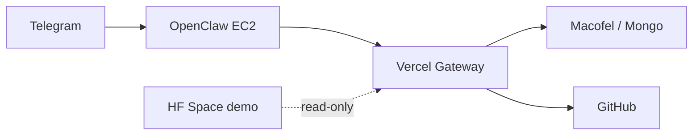

# Agente_OpenClaw (F.R.I.D.A.Y. / Jarvis)

Rede multi-agente da [Aldebaran-LW](https://github.com/Aldebaran-LW) para alertas, rotinas e integracoes (Macofel, GitHub, deploy). **Acoes com impacto exigem aprovacao no Telegram.**

Repo: [github.com/Aldebaran-LW/Agente_OpenClaw](https://github.com/Aldebaran-LW/Agente_OpenClaw)

## Arquitetura



| Camada | Onde | Funcao |
|--------|------|--------|
| **Jarvis + Telegram** | AWS EC2 | Conversa, aprovacoes, cron |
| **Gateway** | Vercel `gateway/` | Secrets + API `/jarvis`, `/openclaw/*` |
| **Cerebros** | `agents/*` | Especialistas (Macofel, Ops, VP-Pecas) |
| **HF (opcional)** | Hugging Face | Demo + backup JSON |

Detalhe: `docs/VISAO-PRODUTO.md` · `docs/PAPEIS-AWS-VERCEL.md` · `docs/ARQUITETURA-AGENTES.md`

## Cerebros e modelos (free)

Cada cerebro tem `agents/<id>/config.yaml` (modelo OpenRouter recomendado):

| ID | Papel | Modelo free |
|----|-------|-------------|
| `orchestrator` | Jarvis | `nvidia/nemotron-3-super-120b-a12b:free` |
| `macofel` | Catalogo | `deepseek/deepseek-v4-flash:free` |
| `heimdall` | GitHub/deploy | `poolside/laguna-m.1:free` |
| `vp-pecas` | Sites usinagem | `minimax/minimax-m2.5:free` |

Fase 1: **uma** `OPENROUTER_API_KEY` para todos. Ver `docs/OPENROUTER-MODELOS-FREE.md`.

## Setup rapido (PC)

```powershell
copy .env.example .env
# Preencher OPENCLAW_AUTOMATION_TOKEN + OPENCLAW_GATEWAY_BASE_URL

.\run-basico.ps1
# ou: cd scripts; node check-basico.js
```

Deploy gateway: `docs/GATEWAY-VERCEL.md` (Root Directory = `gateway`).

## Testes

```powershell
.\run-basico.ps1              # gateway + Jarvis + 4 agentes
.\run-tests.ps1               # chaves, Telegram, GitHub
node scripts/validate-agent-config.mjs
node scripts/sync-agent-config-to-openclaw.mjs --emit-sh   # bash EC2
node scripts/test-hf-token.mjs   # opcional HF
```

## Novo agente + aprendizagem HF

```powershell
node scripts/scaffold-agent.mjs --id meu-bot --name "Meu Bot"
node scripts/hf-ingest-learning.mjs --agent meu-bot --text "nota do HF"
```

Docs: `docs/SYNC-AGENT-CONFIG.md` · `docs/DOMINIO-VERCEL.md` · `docs/ROADMAP-RENDER-PARA-HF.md`

## Pastas principais

| Pasta | Conteudo |
|-------|----------|
| `agents/` | Cerebros + `config.yaml` + `AGENTS.md` |
| `gateway/` | API Vercel (Jarvis, Macofel status, office, forge) |
| `skills/` | Skills OpenClaw |
| `scripts/` | Cron, heartbeat, HF, dashboards |
| `hf-space/demo/` | Space Docker Hugging Face |
| `docs/` | Documentacao completa |

## Seguranca

Ler primeiro: **`POLITICA-SEGURANCA.md`** — pagamentos e PII proibidos; producao so com `sim`/`confirmar`.

## Sync Drive / GitHub

- Drive: `G:\Meu Drive\Projetos\OpenClaw`
- Git local: `C:\Users\LUCAS_W\Documents\GitHub\Agente_OpenClaw`
- Sync: `.\sync-workspaces.ps1`

## Links uteis

- Painel pixel: `{OPENCLAW_GATEWAY_BASE_URL}/office`
- Digital Forge 3D: `{OPENCLAW_GATEWAY_BASE_URL}/forge`
- HF Spaces (demo + friday-prod): `docs/HF-DEPLOY-FRIDAY.md` · resumo `docs/HUGGINGFACE-SPACES.md`
- Inovação (Sophia → Senku → Hefestos): `docs/ARQUITETURA-INOVACAO.md`
- EC2 webhook + nginx: `docs/EC2-ORCHESTRATE-WEBHOOK.md` · mapa `docs/MAPAS-RESIDENCIAS.md`
- Domínio custom: Vercel → Domains → `f.r.i.d.a.y.lwdigitalforge.com` (ou `openclaw.lwdigitalforge.com`)