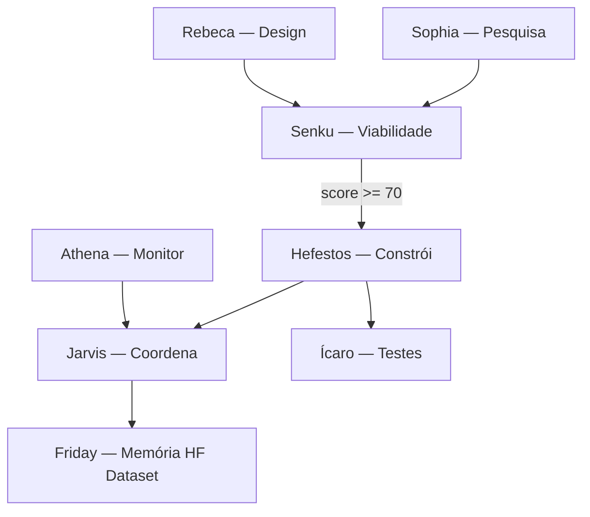

# Arquitetura de inovação contínua — OpenClaw

Camada **cognitiva** (pesquisa → design → viabilidade → construção) sobre os cérebros **operacionais** já existentes (Jarvis, Macofel, Ops, VP-Pecas).

**Produção e segurança:** `POLITICA-SEGURANCA.md` — Hefestos **não** altera produção sem `sim`/`confirmar` do Lucas (via Jarvis/Telegram).

---

## Duas camadas

| Camada | Agentes | Função |
|--------|---------|--------|
| **Operação** | `orchestrator`, `macofel`, `ops`, `vp-pecas` | Portfólio, catálogo, GitHub, deploy |
| **Inovação** | `sophia`, `rebeca`, `senku`, `hefestos` | Descobrir, desenhar, avaliar, implementar |
| **Suporte** | `icaro`, `athena`, `dedalo` | Testes, monitorização, schemas HF/dados |

**Memória:** Dataset HF `openclaw-backup` + `hf-ingest-learning.mjs` (papel “Friday” no ecossistema F.R.I.D.A.Y.).

**GitHub org:** cérebro `ops` (Aldebaran-LW).

---

## Pipeline principal



### Sophia (pesquisa)

Fontes recomendadas: Web, Hugging Face Hub, GitHub Trending, Papers with Code, Product Hunt, Reddit (r/LocalLLaMA, r/OpenClaw, etc.).

Saída: YAML em `data/innovation/` — esquema `agents/_shared/schemas/pesquisa-entry.yaml`.

### Rebeca (design)

UI/UX (Penpot, Figma free), 3D/Web (Three.js, R3F), assets IA, inspiração (Awwwards, Dribbble). Foco: dashboards `/office` e `/forge`.

### Senku (viabilidade)

| Critério | Peso |
|----------|------|
| Custo de implementação | 30% |
| Retorno lucrativo potencial | 35% |
| Compatibilidade stack (Node, Python, HF, Vercel, AWS) | 20% |
| Manutenibilidade | 15% |

**`viabilidade_score` 0–100.** Hefestos só executa se **≥ 70** (e aprovação humana para produção).

### Hefestos (construtor)

Subfunções: integrador de skills, otimizador (gateway/scripts), documentação (`docs/`).

---

## Agentes sugeridos (implementados)

| Agente | ID | Prioridade | Forge alias |
|--------|-----|------------|-------------|
| Ícaro | `icaro` | Alta | `icaro` |
| Athena | `athena` | Média | `athena` |
| Dédalo | `dedalo` | Média | `dedalo` |

### VP-Pecas (futuro — cotação B2B)

Escopo alvo: lista de peças + tolerâncias → comparativo fornecedores (preço, lead time, frete) → recomendação. Ver `agents/vp-pecas/AGENTS.md`.

### Hermes (POC — não criado)

Atendimento Telegram white-label; reutiliza base Jarvis. Só após política de mensagens em nome do Lucas estiver explícita.

---

## Mapeamento F.R.I.D.A.Y. ↔ OpenClaw

| Persona | Cérebro OpenClaw |
|---------|------------------|
| Jarvis | `orchestrator` |
| Friday | Memória (`hf-ingest-learning`, Dataset) |
| Macofel / Lala | `macofel` |
| Byte | `ops` |
| Pixel | `vp-pecas` |
| Sophia, Rebeca, Senku, Hefestos | `sophia` … `hefestos` |

---

## Comandos

```powershell
# Pipeline completo (dry-run sem OPENROUTER_API_KEY)
node scripts/innovation-pipeline.mjs --topic "nova skill OpenClaw" --dry-run

# Com LLM
node scripts/innovation-pipeline.mjs --topic "ferramentas HF gratuitas"

# Atalho PowerShell
.\scripts\roda-pesquisa.ps1 -Topic "dashboard forge melhorias"

# Regenerar openclaw + validar
node scripts/validate-agent-config.mjs
node scripts/sync-agent-config-to-openclaw.mjs --dry-run
```

---

## Ficheiros

| Caminho | Conteúdo |
|---------|----------|
| `agents/sophia/` … `agents/hefestos/` | Config + AGENTS.md |
| `agents/icaro/`, `athena/`, `dedalo/` | Suporte |
| `scripts/innovation-pipeline.mjs` | Orquestração Sophia→Senku |
| `data/innovation/` | Artefactos YAML (gitignored) |
| `docs/ARQUITETURA-AGENTES.md` | Hub operacional |

---

## Residências (onde cada um mora)

Mapa oficial: **`docs/MAPAS-RESIDENCIAS.md`** — AWS (Jarvis/Macofel), Vercel (Friday gateway), HF (inovação provisória).

Broker: `POST /openclaw/orchestrate` · EC2: `scripts/ec2-orchestrate-hook.mjs`

## Ver também

- `docs/MAPAS-RESIDENCIAS.md` — moradia EC2 / Vercel / HF
- `docs/HF-DEPLOY-FRIDAY.md` — Spaces HF
- `docs/DIGITAL-FORGE-FRIDAY.md` — `/forge` 3D
- `docs/OPENROUTER-MODELOS-FREE.md` — modelos por cérebro
