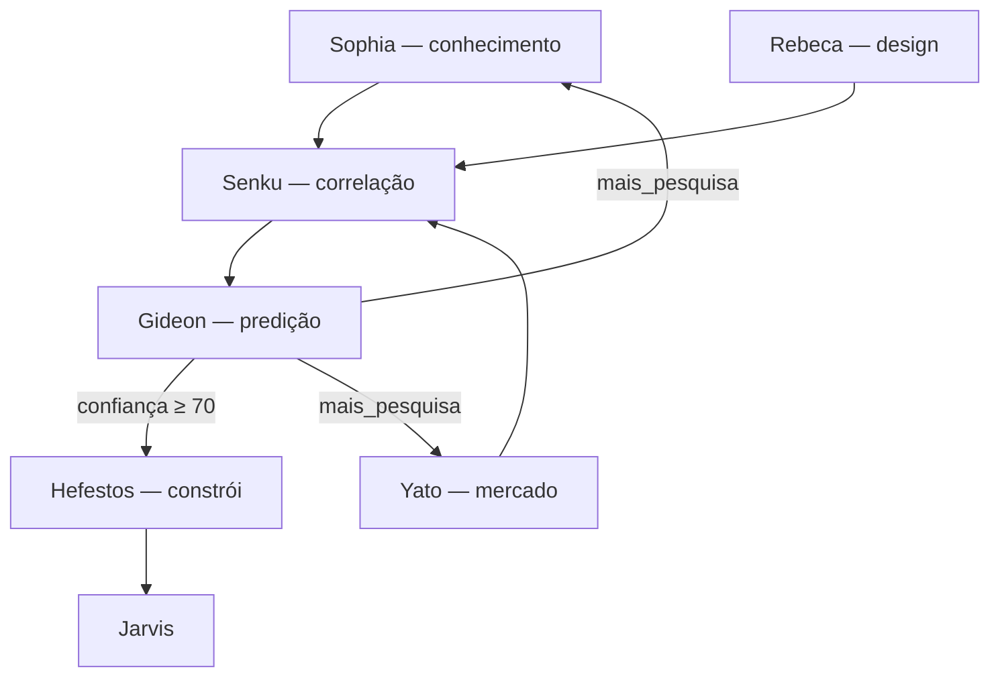

# Arquitetura de inovação contínua — OpenClaw

Quatro cérebros de pesquisa/análise + Rebeca (design) + Hefestos (construção), orquestrados pelo **Jarvis**.

**Segurança:** `POLITICA-SEGURANCA.md` — Hefestos só em produção com `sim`/`confirmar`.

---

## Pipeline (versão final)



| Agente | ID | Foco | Saída (Dataset HF) |
|--------|-----|------|-------------------|
| **Sophia** | `sophia` | Ferramentas, libs, tutoriais, tecnologias | `knowledge/` |
| **Yato** | `yato` | Mercado, concorrência, demanda | `market/` |
| **Senku** | `senku` | Correlaciona presente; pede nova pesquisa | `analysis/` |
| **Gideon** | `gideon` | Cenários e predição futura | `predictions/` |
| **Rebeca** | `rebeca` | Design UI/forge | — |
| **Hefestos** | `hefestos` | Implementação | — |

**Senku** processa o **presente**. **Gideon** projeta o **futuro**.

---

## Scripts

```bash
# Conhecimento
node scripts/sophia-research.mjs --topic "ai agents" --yaml

# Mercado
node scripts/yato-market-search.mjs --topic "saas agents" --yaml

# Análise → Predição
node scripts/senku-process.mjs --topic "ai agents"
node scripts/gideon-predict.mjs --topic "ai agents"

# Pipeline completo (determinístico, sem OpenRouter)
node scripts/innovation-pipeline.mjs --topic "tema" --deterministic
```

Legado: `yato-search-hf.mjs` redirecciona para **Sophia**.

---

## Camadas do ecossistema

| Camada | Agentes |
|--------|---------|
| Operação | `orchestrator`, `macofel`, `heimdall`, `vp-pecas` |
| Inovação | `sophia`, `yato`, `rebeca`, `senku`, `gideon`, `hefestos` |
| Suporte | `icaro`, `rimuru`, `veldora`, `dedalo` |

Memória: Dataset `openclaw-backup` · ingest: `hf-ingest-learning.mjs`

---

## Ficheiros

| Caminho | Conteúdo |
|---------|----------|
| `agents/sophia/` … `agents/hefestos/` | Config + AGENTS.md |
| `scripts/innovation-pipeline.mjs` | Orquestração |
| `data/innovation/` | Artefactos locais (gitignored) |

Ver também: `docs/MAPAS-RESIDENCIAS.md`, `docs/OPENROUTER-MODELOS-FREE.md`
