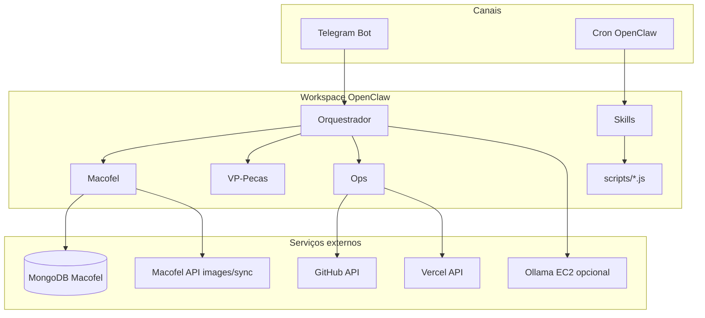
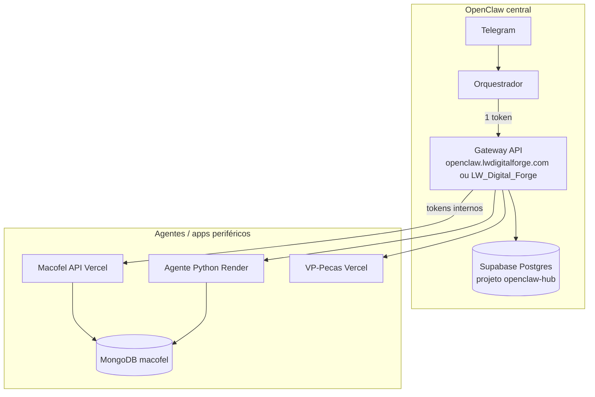

# Project analysis for OpenClaw
_Exported on 27/05/2026 at 20:30:00 BRT from Cursor (3.2.16)_

---

**User**

Analise esse projeto -> G:\Meu Drive\Projetos\OpenClaw

---

**Cursor**

Vou explorar a estrutura do projeto e a documentação principal para montar uma análise completa.


# Análise do projeto OpenClaw

O **OpenClaw** (`G:\Meu Drive\Projetos\OpenClaw`) não é uma aplicação web tradicional. É um **workspace de automação multi-agente** para o portfólio [Aldebaran-LW](https://github.com/Aldebaran-LW): instruções para cérebros especializados, skills reutilizáveis, scripts Node.js e documentação de deploy — tudo pensado para correr com a plataforma [OpenClaw](https://openclaw.ai) e falar contigo pelo **Telegram**.

Repositório remoto: [github.com/Aldebaran-LW/Agente_OpenClaw](https://github.com/Aldebaran-LW/Agente_OpenClaw) (1 commit inicial no Git; muito conteúdo local ainda não versionado).

---

## Propósito

Assistente local para **alertas**, **rotinas agendadas** e **integrações** dos teus projetos (Macofel, VP-Pecas, GitHub, Vercel), com regra central: **nada de impacto em produção sem aprovação explícita** (`sim` / `confirmar` / `ok`).

O que **não** faz (por desenho):

- Não substitui o agente Python de catálogo na Render (Macofel).
- Não faz RPA no browser (admin, Gemini web).
- Pagamentos e envio de PII a terceiros são **proibidos sempre** (`POLITICA-SEGURANCA.md`).

---

## Arquitetura (visão geral)



**Hierarquia de decisão:** `POLITICA-SEGURANCA.md` → aprovação tua → `AGENTS.md` do cérebro → skills.

---

## Estrutura do repositório

| Pasta / ficheiro | Função |
|------------------|--------|
| `agents/` | 4 “cérebros”: orquestrador, macofel, vp-pecas, ops — cada um com `AGENTS.md` |
| `skills/` | Comportamentos reutilizáveis (`macofel-status`, `macofel-images-sync`, `github-aldebaran`, `deploy-monitor`, `politica-seguranca`, `vercel-status`) |
| `scripts/` | Automação **sem LLM** (MongoDB, GitHub, Vercel) |
| `config/cron-examples.json` | Exemplos de rotinas (9h catálogo, segunda GitHub, health-check 6h) |
| `docs/` | Instalação, variáveis, portfólio, VPS, conversas Cursor exportadas |
| `openclaw.json.example` | Mapa de agentes e skills por defeito |
| `.env.example` | Modelo de secrets (Telegram, LLMs, GitHub, Macofel, AWS, Vercel) |
| `sync-workspaces.ps1` | Espelho **Local ↔ Google Drive** (canónico Git: `C:\Users\LUCAS_W\Documents\GitHub\Agente_OpenClaw`) |
| `run-tests.ps1` | Diagnóstico de chaves + testes Telegram/GitHub/Vercel/MongoDB |
| `scripts/vps-*.ps1` / `*.sh` | Deploy e setup em VPS (FreeVPS) e scripts EC2/Ollama |

---

## Os quatro cérebros

| ID | Papel | Skills principais |
|----|--------|-------------------|
| **orchestrator** | Coordena, pede aprovação, prioriza scripts/API antes de LLM | `github-aldebaran`, `deploy-monitor` |
| **macofel** | Catálogo e-commerce, contagens MongoDB, sync imagens via API | `macofel-status`, `macofel-images-sync` |
| **vp-pecas** | Sites de usinagem | `github-aldebaran`, `deploy-monitor` |
| **ops** | GitHub + deploy | idem VP-Pecas |

O orquestrador define uma **ordem de custo**: scripts/API → Ollama local (EC2) → Gemini/OpenRouter free → modelos pagos só com pedido explícito.

---

## Scripts (núcleo técnico)

Todos em `scripts/`, com `npm install` e dependência `mongodb`:

1. **`macofel-count-pending.js`** — lê `MONGODB_URI`, conta `pending_review` e estados `image_sync_*` na coleção `products`.
2. **`github-repo-status.js`** — último push e issues dos 3 repos Aldebaran-LW.
3. **`vercel-status.js`** — deployments recentes via `VERCEL_API_TOKEN`.
4. **`test-env.js`** — validação de ambiente (usado no `npm test`).

Padrão bom: **skills pedem ao agente que execute estes scripts**, em vez de “ir ver” com LLM — mais barato, determinístico e alinhado com a política.

---

## Integrações do portfólio

Documentado em `docs/VISAO-PORTFOLIO.md`:

| Projeto | Automação OpenClaw |
|---------|-------------------|
| **Macofel 2.0** | Alta — status catálogo, sync imagens (POST API), alertas deploy |
| **VP-Pecas / vp-precision-studio** | Média — health-check, issues GitHub |
| **Ponto / Estoque / bots locais** | Fase futura (não duplicar bots existentes) |

Fluxo Macofel (resumido):

```
Excel → Vercel/Render → MongoDB (pending_review)
         → Agente Python Render (enriquecimento)
         → OpenClaw (opcional) → POST images/sync
         → Admin aprova → loja
```

---

## Infraestrutura (3 “camadas”)

1. **PC local** — workspace, `.env`, scripts, sync com Drive.
2. **VPS** (`docs/VPS-SETUP.md`) — gateway OpenClaw em `/opt/openclaw`, systemd `openclaw-gateway`, IP `45.147.46.122`.
3. **Vercel** — domínio `openclaw.lwdigitalforge.com` como gateway de automação (`OPENCLAW_GATEWAY_BASE_URL` no `.env.example`).
4. **AWS EC2** (opcional) — scripts `ec2-install-ollama.sh`, `ec2-configure-openclaw-ollama.sh` para LLM local.

Há também scripts PowerShell para deploy SSH (`vps-deploy.ps1`, `vps-ssh-test.ps1`).

---

## Segurança

Pontos fortes:

- `POLITICA-SEGURANCA.md` clara e referenciada em todo o lado.
- `.gitignore` cobre `.env`, `Chaves/`, `*.pem`, `Tokens.txt`, `node_modules`.
- Skills de escrita (`macofel-images-sync`) exigem confirmação EAN a EAN.

**Atenção (estado atual do workspace):**

- Existem ficheiros sensíveis no disco (`Chaves/OpenClaw.pem`, `Chaves/Tokens.txt`, `.env`) — estão ignorados pelo Git, mas **não devem ir para o remoto** nem para pastas partilhadas sem criptografia.
- O `git status` mostra muitos ficheiros untracked (incl. `node_modules` em `scripts/`) — convém manter o repo limpo antes do próximo commit.
- `agents/macofel/AGENTS.md` parece estar em **UTF-16** (caracteres espaçados); pode confundir ferramentas de leitura — vale regravar em UTF-8.

---

## Maturidade e roadmap

| Área | Estado |
|------|--------|
| Documentação conceitual | Boa (`VISAO-PORTFOLIO`, `INSTALACAO`, `VARIAVEIS-AMBIENTE`, política) |
| Scripts de leitura | Implementados e testáveis via `run-tests.ps1` |
| Sync imagens Macofel | Skill + API documentada; execução real depende de `.env` e confirmação |
| Cron / Telegram | Exemplos prontos; depende de `openclaw onboard` + gateway ativo |
| Git | 1 commit; Drive e local podem divergir — usar `sync-workspaces.ps1` |
| Testes automatizados | Smoke tests via scripts, sem suite unitária |

Roadmap sugerido no próprio projeto (4 semanas): Telegram + cron Macofel → MongoDB estável → sync 1 EAN teste → monitor GitHub/deploy.

---

## Pontos fortes

1. **Separação clara** entre automação determinística (scripts) e raciocínio (LLM).
2. **Multi-agente** com escopos bem definidos e orquestrador com política de aprovação.
3. **Política de segurança** explícita e skill `politica-seguranca` sempre activa.
4. **Dual workspace** (Git local + Drive) com script de sync e backup de `.env`.
5. **Alinhamento com o portfólio real** (Macofel, VP-Pecas, 3 repos GitHub).

---

## Riscos e melhorias sugeridas

1. **Commit inicial vs. working tree** — muito código útil só no Drive; sincronizar e fazer commit limpo (sem secrets, sem `node_modules`).
2. **Corrigir encoding** de `agents/macofel/AGENTS.md` (e verificar outros `.md` se necessário).
3. **Alinhar `openclaw.json.example`** com a skill `vercel-status` (existe na pasta `skills/` mas não está na lista default do JSON).
4. **README.md** muito curto — o `AGENTS.md` da raiz é o verdadeiro “readme”; podes fundir ou expandir o README com link para instalação.
5. **Confirmar gateway** — validar se VPS, Vercel e/ou EC2 estão todos necessários ou se há sobreposição de custos.
6. **Rodar** `.\run-tests.ps1` periodicamente para validar tokens sem expor valores no chat.

---

## Comandos úteis (no teu PC)

```powershell
cd "G:\Meu Drive\Projetos\OpenClaw"
.\run-tests.ps1
cd scripts; npm install; node macofel-count-pending.js
node github-repo-status.js
.\sync-workspaces.ps1
```

---

## Conclusão

O OpenClaw é um **centro de comando bem pensado** para o teu ecossistema Aldebaran-LW: política de segurança forte, agentes especializados, skills acionáveis e scripts que evitam gastar tokens à toa. O núcleo de valor está em **Macofel (MongoDB + sync imagens)** e **monitorização GitHub/Vercel**, com Telegram como interface humana.

O projeto está na fase **“workspace configurado + scripts prontos”**, a caminho de **“produção confiável”** assim que o gateway OpenClaw, o cron e o `.env` estiverem estáveis nos três ambientes (PC, VPS/Vercel, opcional EC2/Ollama).

Se quiseres, no próximo passo posso: (1) correr o diagnóstico `run-tests.ps1` e resumir o que está OK/falta, (2) rever o encoding dos `AGENTS.md`, ou (3) ajudar a preparar um commit limpo para o GitHub (só quando pedires).

---

**User**

 continue

---

**Cursor**

Continuando: vou executar o diagnóstico e corrigir problemas detectados (encoding dos `AGENTS.md`, alinhamento de config).


# Continuação — diagnóstico e correções

Executei o `run-tests.ps1`, corrigi ficheiros corrompidos e ajustei a configuração. Resumo:

---

## Resultado do diagnóstico

| Componente | Estado | Detalhe |
|------------|--------|---------|
| **Telegram** | OK | Bot `@LW_Acessor_bot` responde |
| **GitHub** | OK | 3 repos Aldebaran-LW acessíveis |
| **Vercel API** | Parcial | Token válido, mas `projects: []` |
| **MongoDB** | Falha | `querySrv ECONNREFUSED` (DNS/rede Atlas) |
| **Google API** | Vazio | `GOOGLE_API_KEY` não preenchida |
| **OpenClaw CLI** | OK | v2026.5.22 instalado |
| **Sync Drive ↔ Local** | OK | 0 ficheiros novos (já alinhados) |

---

## Problemas encontrados e o que foi feito

### 1. `AGENTS.md` corrompidos (UTF-16 / texto ilegível)

Os ficheiros `agents/macofel`, `vp-pecas` e `ops` estavam em encoding errado. **Regravados em UTF-8** no Drive e na cópia local (`C:\Users\LUCAS_W\Documents\GitHub\Agente_OpenClaw`).

### 2. `node_modules` no Google Drive

O Drive **corrompe** pacotes npm (`mongodb/package.json` vazio no Drive). Por isso o script Macofel falhava no caminho `G:\Meu Drive\...`.

**Correção:**
- `run-tests.ps1` passa a usar automaticamente `C:\Users\LUCAS_W\Documents\GitHub\Agente_OpenClaw\scripts` quando o Drive está corrompido
- `docs/INSTALACAO.md` documenta: **sempre** `npm install` na cópia local, não no Drive

### 3. `openclaw.json.example`

Adicionada a skill `vercel-status` aos defaults e aos cérebros **orchestrator**, **vp-pecas** e **ops**.

---

## O que ainda precisas de resolver (manual)

### MongoDB — `ECONNREFUSED` no SRV

O pacote npm está OK na cópia local; o erro é **ligação à Atlas**:

1. [MongoDB Atlas](https://cloud.mongodb.com) → **Network Access** → permitir o teu IP (ou `0.0.0.0/0` temporariamente para teste)
2. Confirmar que `MONGODB_URI` no `.env` está correto (cluster activo)
3. Testar rede/DNS: às vezes VPN ou firewall bloqueia `mongodb+srv://`

```powershell
cd "C:\Users\LUCAS_W\Documents\GitHub\Agente_OpenClaw\scripts"
node macofel-count-pending.js
```

### Vercel — lista de projetos vazia

O token funciona, mas a API devolve 0 projetos. Causas comuns:

- Projetos estão num **team** → adicionar `VERCEL_TEAM_ID` no `.env` (Vercel → Team Settings → Team ID)
- Token sem scope para os projetos certos → criar token com acesso ao team/conta certa

### `GOOGLE_API_KEY` vazia

Só necessária se usares Gemini no gateway/VPS. Para alertas via scripts **não é obrigatória**.

---

## Ficheiros alterados nesta sessão

- `agents/macofel/AGENTS.md`, `agents/vp-pecas/AGENTS.md`, `agents/ops/AGENTS.md` — UTF-8 limpo
- `openclaw.json.example` — skill `vercel-status`
- `run-tests.ps1` — fallback para scripts locais
- `docs/INSTALACAO.md` — aviso sobre `node_modules` no Drive

---

## Próximo passo recomendado

1. Corrigir acesso MongoDB na Atlas e voltar a correr `.\run-tests.ps1`
2. Se usares team Vercel, preencher `VERCEL_TEAM_ID` e testar de novo
3. Quando estiver tudo verde, podes pedir um **commit limpo** para o GitHub (sem `.env`, `Chaves/`, `node_modules`)

Queres que eu investigue o Vercel (team ID / resposta da API) ou o MongoDB Atlas em mais detalhe?

---

**User**

e a supabase onde pretendo deixar como central; alem desse projeto G:\Meu Drive\Projetos\LW_Digital_Forge, estou pensando desse ser o banco de dados de morada do OpenClaw "central", oq acha? os BD da mongo pretendo deixar mais nas maos dos outros agentes/API que converçaram com o central

---

**Cursor**

Boa direção — vou olhar o que já existe no OpenClaw e no `LW_Digital_Forge` para avaliar Supabase como hub central vs MongoDB nos agentes periféricos.


A ideia faz sentido e encaixa bem no que o OpenClaw já está a caminhar de ser: **orquestrador**, não dono dos dados de negócio de cada app.

---

## Opinião em uma frase

**Sim — Supabase como “casa” do OpenClaw central e Mongo nos periféricos (Macofel, Render, APIs) é uma arquitetura sólida**, desde que o central **não leia Mongo direto** no dia a dia, e o `LW_Digital_Forge` vire o repo do **schema + gateway**, não só uma pasta de notas.

---

## Por que Supabase encaixa melhor que Mongo “geral”

| | **Supabase (Postgres)** | **Mongo (Atlas)** |
|--|-------------------------|-------------------|
| Papel natural | Hub: filas, aprovações, logs, config, integrações | Domínio: catálogo Macofel, documentos flexíveis |
| “Geral” | Um projeto pode servir vários cérebros com tabelas claras | Cada app = URI/DB próprio; não há Auth/RLS/Edge “de fábrica” |
| OpenClaw central | Estado, auditoria, Telegram approvals | Só via **API Macofel** ou agente Render |
| Já no teu stack | Macofel_2.0 já usa Supabase + Mongo | Macofel mantém Mongo para `products` |

Mongo **não substitui** um backend comum; Supabase **sim** (Postgres + RLS + Storage + Edge Functions + webhooks).

O teu `.env.example` já aponta nessa direção com `OPENCLAW_GATEWAY_BASE_URL` + `OPENCLAW_AUTOMATION_TOKEN`: o passo lógico é o gateway persistir e orquestrar em **Supabase**, não espalhar `MONGODB_URI` no OpenClaw.

---

## Arquitetura recomendada (hub & spoke)



**Regra prática**

- **No Supabase (central):** o que é *operação do OpenClaw*, não catálogo de loja.
- **No Mongo (Macofel):** produtos, `pending_review`, `image_sync_status` — só o **cérebro Macofel** ou o **gateway** falam com isso, nunca o orquestrador com URI no `.env` do PC/EC2.

---

## O que guardar no Supabase central

Sugestão mínima (fase 1):

| Tabela / conceito | Conteúdo |
|-------------------|----------|
| `approval_requests` | Pedidos do agente (“sync 1 EAN”, “deploy”) + estado `pending/approved/rejected` + `telegram_message_id` |
| `job_queue` | Cron, retries, `skill`, payload JSON, `run_at` |
| `integration_health` | Último snapshot: GitHub push, Vercel deploy, HTTP Macofel (sem PII) |
| `audit_log` | Quem pediu, o que executou, resultado (sem secrets) |
| `agent_config` | Versão de skills, flags por projeto (opcional) |

**Não** replicar `products` do Macofel no Postgres — só **métricas agregadas** (`pending_review: 42`) vindas da API ou de um job no gateway.

---

## Papel do `LW_Digital_Forge`

Hoje a pasta está quase vazia (`LWDigitalForge_Texte`); no portfólio estava “fora de escopo”. Para ser a **morada do central**, faria sentido evoluir para:

```
LW_Digital_Forge/
  supabase/migrations/     # schema openclaw-hub
  api/ ou app/             # gateway (Next/Vercel) — pode ser o mesmo domínio openclaw.lwdigitalforge.com
  docs/                    # contrato das rotas /openclaw/*
```

**OpenClaw** (`G:\...\OpenClaw`) continua: agentes, skills, Telegram, scripts locais — mas **deixa de ser dono dos secrets Render/Vercel/Mongo**; só `OPENCLAW_AUTOMATION_TOKEN` + URL do gateway (+ opcional `SUPABASE_URL` se algum script local escrever direto, o que eu evitaria).

---

## Mongo “nas mãos dos outros agentes”

Concordo, com um detalhe importante:

| Abordagem | Avaliação |
|-----------|-----------|
| OpenClaw PC/EC2 com `MONGODB_URI` | Funciona hoje (`macofel-count-pending.js`), mas **acopla** o central ao Atlas e ao Drive |
| Macofel API + Render agent | **Melhor** — domínio fica no Macofel |
| Gateway chama Mongo com service account | OK **só no servidor** (Vercel/Render), nunca no `.env` do OpenClaw |

Fluxo alvo para “status macofel”:

```
Telegram → Orquestrador → GET gateway/openclaw/macofel/status
                         → gateway → Macofel API ou Mongo interno
                         → gateway grava snapshot em Supabase
```

O script Mongo local pode ficar como **fallback de dev**, não como caminho de produção.

---

## Macofel já tem Supabase — dois projetos ou um?

O Macofel_2.0 já usa **Mongo + Supabase**. Recomendação:

- **Projeto Supabase `openclaw-hub`** (ou nome em `LW_Digital_Forge`) — só dados do central.
- **Supabase do Macofel** — continua para o que o app e-commerce já usa (auth, storage, etc.).

Evitar misturar tudo num único Postgres sem namespaces claros (`openclaw_*` vs tabelas da loja). Dois projetos Supabase no mesmo org é normal e mais seguro (RLS e backups separados).

---

## Alinhamento com o que já tens

1. **Gateway Vercel** (`OPENCLAW_GATEWAY_BASE_URL`) — bom sítio para hospedar API + secrets.
2. **Um token no OpenClaw** — mantém a política de segurança simples.
3. **Supabase MCP** no Cursor — útil para migrations e `list_tables` no hub.
4. **Cérebro Macofel** — passa a consumir API/gateway; `MONGODB_URI` sai do `.env` do OpenClaw quando o gateway estiver pronto.

---

## Riscos a evitar

1. **Duplicar catálogo** no Postgres — manutenção dupla e bugs de sync.
2. **Service role do Supabase no EC2/Telegram** — preferir gateway; RLS no hub para tudo que não for server-side.
3. **Google Drive como “casa” do código do hub** — `LW_Digital_Forge` e migrations Supabase em pasta **local/Git**, como já fazes com `Agente_OpenClaw`.
4. **OpenClaw falar com Mongo e Supabase para a mesma métrica** — uma fonte de verdade por métrica (API → snapshot no Supabase).

---

## Caminho em fases (pragmático)

| Fase | Entrega |
|------|---------|
| **0** | Definir no `LW_Digital_Forge`: repo + projeto Supabase `openclaw-hub` |
| **1** | Migrations: `approval_requests`, `job_queue`, `audit_log` |
| **2** | Gateway: `GET /openclaw/macofel/status` (lê Macofel, grava snapshot) |
| **3** | OpenClaw: skill `macofel-status` chama gateway, não `node macofel-count-pending.js` |
| **4** | Aprovações Telegram ↔ linhas em `approval_requests` |
| **5** | Remover `MONGODB_URI` do `.env` do OpenClaw (opcional, quando estável) |

---

## Conclusão

A tua intuição está correta: **Supabase = sistema nervoso central** (estado, filas, aprovações, logs); **Mongo = memória muscular do Macofel** (catálogo), acessada por APIs/agentes periféricos. **`LW_Digital_Forge` como morada do hub** é coerente se virar repo com migrations + gateway, não só documentação.

O OpenClaw em `G:\...\OpenClaw` permanece o **cérebro conversacional e políticas**; o **banco central** mora no Supabase gerido a partir do Digital Forge.

Se quiseres, no próximo passo posso esboçar o **schema SQL inicial** (`approval_requests`, `job_queue`, etc.) e o **contrato mínimo do gateway** (rotas + headers) para encaixar no que já tens na Vercel — sem mexer em produção até confirmares.

---

**User**

por hora nao meche no LW_Digital_Forge, só da seguimento com os agentes

---

**Cursor**

Seguindo só no OpenClaw: vou alinhar os cérebros e skills com a arquitetura hub/periférico, sem tocar no `LW_Digital_Forge`.


Alinhando cérebros, skills e um script unificado de status Macofel — tudo dentro do OpenClaw.


Seguimento feito **só no OpenClaw** — sem mexer no `LW_Digital_Forge`.

---

## O que mudou

### Documentação
- **`docs/ARQUITETURA-AGENTES.md`** — hub (orquestrador) vs periféricos (macofel, vp-pecas, ops); Mongo só no cérebro Macofel; Supabase mencionado só como futuro.

### Cérebros (`agents/*/AGENTS.md`)
- **Orquestrador** — tabela de roteamento, proibição de Mongo, delegação explícita.
- **Macofel** — único dono de catálogo/Mongo; ordem gateway → API → script.
- **VP-Pecas / Ops** — escopo claro, sem Macofel; `vercel-status` no Ops.

### Skills
- **`macofel-status`** — usa `node macofel-status.js`; orquestrador não corre Mongo.
- **`macofel-images-sync`** — só cérebro `macofel`, após confirmação no Telegram.

### Script novo
- **`scripts/macofel-status.js`** — tenta nesta ordem:
  1. Gateway `openclaw.lwdigitalforge.com/openclaw/macofel/status`
  2. API Macofel `/api/admin/catalog/status`
  3. `macofel-count-pending.js` (Mongo, fallback)

`package.json` e `run-tests.ps1` passam a usar `macofel-status.js`.

### Raiz
- **`AGENTS.md`** — link para arquitetura, tabela de skills por cérebro.
- **`.env.example`** — comentário: Mongo é do cérebro Macofel, não do orquestrador.

Tudo espelhado em `C:\Users\LUCAS_W\Documents\GitHub\Agente_OpenClaw` onde aplicável.

---

## Teste rápido do script

O fluxo em cadeia funciona; hoje as três fontes falham por ambiente (esperado até configurares):

| Fonte | Resultado |
|-------|-----------|
| Gateway | 404 (rota ainda não existe na Vercel) |
| API Macofel | 503 (URL base parece mal montada: `.../api/import/api/admin/...`) |
| Mongo | `ECONNREFUSED` Atlas (rede/IP) |

Quando o gateway tiver a rota, o orquestrador/macofel passam a usar só o Bearer — sem `MONGODB_URI` no dia a dia.

---

## Como os agentes devem trabalhar agora

```
Telegram → orquestrador (classifica)
    → macofel | vp-pecas | ops
        → skill + script (sem LLM se possível)
```

Exemplos:
- “Quantos pendentes no Macofel?” → **macofel** + `macofel-status`
- “Repos GitHub?” → **ops** + `github-aldebaran`
- “Sites no ar?” → **ops** + `deploy-monitor`

---

## Próximos passos (só agentes/OpenClaw, quando quiseres)

1. Corrigir `MACOFEL_API_BASE` no `.env` (só o host da app, ex. `https://macofel-2-0.vercel.app`, sem `/api/import`).
2. No gateway Vercel, criar `GET /openclaw/macofel/status` (proxy para API ou Mongo no servidor).
3. Atlas: IP permitido para o fallback Mongo deixar de falhar.

Queres que eu ajuste só a documentação do `MACOFEL_API_BASE` ou que esboce o contrato da rota do gateway (sem implementar no Vercel)?

---

**User**

imprementação na vercel, o primeiro Agente ser como o "Jarvis" é para o Tony Stark (Eu)

---

**Cursor**

Implementando o gateway na Vercel com o orquestrador como “Jarvis”. Explorando o que já existe no projeto e no repositório.


Criando o projeto `gateway/` na Vercel com o orquestrador como **Jarvis** — ponto de entrada principal.


Implementei o **gateway Vercel** com o **Jarvis** como primeiro agente (orquestrador). Nada foi alterado no `LW_Digital_Forge`.

---

## O que é o Jarvis

No teu setup, o **Jarvis** é o orquestrador na Vercel: assistente principal (estilo “assistente de confiança”), em português, que **delega** para Macofel, Ops e VP-Pecas sem expor dezenas de tokens no PC/EC2.

```
Tu (Telegram / script)
    → POST /jarvis  (+ Bearer OPENCLAW_AUTOMATION_TOKEN)
        → Jarvis (roteia)
            → macofel | ops | vp-pecas
        → reply em português
```

---

## Pasta nova: `gateway/`

| Rota | Função |
|------|--------|
| `GET /api/health` | Público — serviço no ar |
| `GET /jarvis` | Quem é o Jarvis + rotas |
| **`POST /jarvis`** | `{"message":"status macofel"}` → resposta |
| `GET /openclaw/macofel/status` | Métricas catálogo (já usado pelo script) |
| `GET /openclaw/github/status` | 3 repos Aldebaran-LW |
| `GET /openclaw/deploy/health` | Sites Macofel + VP no ar |

**Segurança:** todas as rotas (exceto `/api/health`) exigem  
`Authorization: Bearer {OPENCLAW_AUTOMATION_TOKEN}`.

Pedidos com **sync/deploy/compra** devolvem `approval.required: true` sem executar.

---

## No OpenClaw (agentes)

- `agents/orchestrator/JARVIS.md` — identidade e tom  
- `agents/orchestrator/AGENTS.md` — secção Jarvis  
- Skill **`openclaw-jarvis`** — `node scripts/jarvis-ask.js "..."`  
- `openclaw.json.example` — orquestrador renomeado para **"Jarvis (Orquestrador)"**  
- `docs/GATEWAY-VERCEL.md` — guia de deploy  

Código em:  
`C:\Users\LUCAS_W\Documents\GitHub\Agente_OpenClaw\gateway\`  
(cópia em `G:\Meu Drive\Projetos\OpenClaw\gateway\`)

---

## Deploy na Vercel (precisas fazer uma vez)

1. [vercel.com](https://vercel.com) → **Add Project** → repo `Agente_OpenClaw`  
2. **Root Directory:** `gateway`  
3. **Environment Variables** (copiar do teu `.env` local):

   - `OPENCLAW_AUTOMATION_TOKEN` (o mesmo do OpenClaw)
   - `GITHUB_TOKEN`, `GITHUB_OWNER=Aldebaran-LW`
   - `MONGODB_URI`, `MONGODB_DB_NAME=macofel`
   - `MACOFEL_API_BASE` → ex. `https://macofel-2-0.vercel.app` (**sem** `/api/import`)
   - `MACOFEL_CATALOG_SECRET` (se a API pedir)
   - `MACOFEL_URL`, `VP_PECAS_URL`

4. Domínio: `openclaw.lwdigitalforge.com`  
5. **Redeploy**

Testar:

```powershell
cd "C:\Users\LUCAS_W\Documents\GitHub\Agente_OpenClaw\scripts"
node jarvis-ask.js "ajuda"
node jarvis-ask.js "status macofel"
```

---

## Depois do deploy

O `macofel-status.js` deixa de dar **404** no gateway e o Jarvis passa a responder no Telegram (quando o OpenClaw usar `POST /jarvis` ou a skill `openclaw-jarvis`).

**Nota:** Jarvis usa **roteamento por palavras-chave** (rápido, sem custo de LLM na Vercel). LLM opcional mais tarde com `GOOGLE_API_KEY` na Vercel, se quiseres conversa mais natural.

---

Queres que no próximo passo eu te guie no deploy passo a passo na Vercel (screens/variáveis) ou que ligue o bot Telegram para chamar o Jarvis automaticamente?

