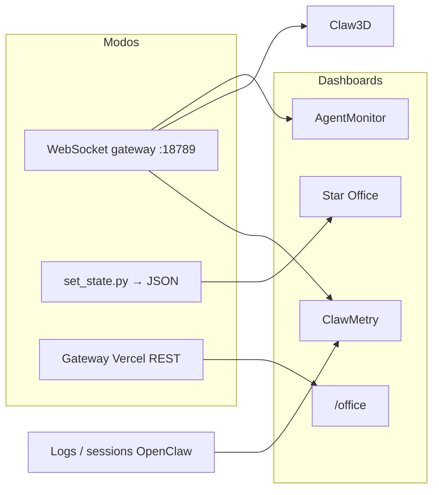

# Dashboards visuais — projetos prontos + integração OpenClaw

Não é obrigatório construir UI do zero. Estes projetos ligam-se ao OpenClaw (WebSocket, `set_state.py` ou ambos).

**Stack Aldebaran-LW:** gateway Vercel + OpenClaw na EC2. Ver também [VISUALIZACAO-AGENTES.md](./VISUALIZACAO-AGENTES.md) (painel `/office` incluído no repo).

---

## Tabela de projetos (2026)

| Projeto | Estilo | Destaque | Instalação rápida |
|---------|--------|----------|-------------------|
| [Star Office UI](https://github.com/ringhyacinth/Star-Office-UI) | Pixel 2D | Multi-agente, join key, memória “ontem”, PT/CN/EN/JP | `./scripts/install-visual-dashboard.sh star-office` |
| [AgentMonitor](https://github.com/ruiqili2/agent-monitor) | Pixel 2D | 18+ comportamentos, chat “patrão”, autowork | `./scripts/install-visual-dashboard.sh agent-monitor` |
| [tenacitOS](https://github.com/carlosazaustre/tenacitOS) | 3D (R3F) | Sala 3D, custos/tokens, editor ficheiros | `git clone` + `npm install` (manual) |
| [Divan](https://github.com/talhaorak/divan) | 3D (Three.js) | Agentes “planetas”, árvore de objetivos, i18n | `git clone` + docs do repo |
| [OpenClaw-Monitor3D](https://github.com/ccperdst-lab/openclaw-monitor) | 3D | Mapa continental, personagens | `./scripts/install-visual-dashboard.sh monitor3d` |
| [openclaw-office](https://github.com/WW-AI-Lab/openclaw-office) | Isométrico 2D SVG | WebSocket gateway, tokens/custos | Ver [VISUALIZACAO-AGENTES.md](./VISUALIZACAO-AGENTES.md) |
| [Claw3D](https://www.claw3d.ai/) | 3D escritório | Standups, review PR | Túnel `scripts/claw3d-tunnel.ps1` |
| [ClawMetry](https://github.com/vivekchand/clawmetry) | Dashboard técnico | Tokens, crons, aba **Flow**, memória, OTLP | `./scripts/install-visual-dashboard.sh clawmetry` |
| **OpenClaw `/office`** (este repo) | Pixel mínimo | Só REST, 4 cérebros, Vercel | Deploy `gateway/` → `/office` |
| **Digital Forge** (este repo) | 3D minimal cobalto | Reator, feixes, personas FRIDAY | `/forge` + WS `:8787` — [DIGITAL-FORGE-FRIDAY.md](./DIGITAL-FORGE-FRIDAY.md) |

### Recomendação para começar

| Prioridade | Projeto | Porquê |
|------------|---------|--------|
| 1 | **Painel `/office`** | Já no deploy Vercel — zero install na EC2 |
| 2 | **ClawMetry** | Observabilidade completa na EC2; `pip` + auto-detect do workspace OpenClaw |
| 3 | **AgentMonitor** | Auto-liga ao gateway local `:18789`, pixel + chat |
| 4 | **Star Office UI** | `set_state.py` simples, PT, multi-agente com join key |

---

## Como funciona a integração



| Modo | Dashboards | O agente precisa de… |
|------|------------|---------------------|
| **WebSocket** | AgentMonitor, Claw3D, openclaw-office | OpenClaw a correr; túnel SSH se aceder do PC |
| **Logs / workspace local** | ClawMetry | OpenClaw na mesma máquina; lê `~/.openclaw/` |
| **Ficheiro JSON** | Star Office, scripts custom | Correr `set_state.py` ao mudar tarefa |
| **REST** | `/office` Vercel | Nada na EC2 (estado inferido de Macofel/GitHub/deploy) |

---

## `set_state.py` (neste repo)

Script: `scripts/set_state.py` (Windows: `scripts/set_state.ps1`).

```bash
# Um agente (default: main)
python3 scripts/set_state.py idle "Pronto"

# Cérebros Aldebaran
python3 scripts/set_state.py syncing "Sync imagens" --agent macofel
python3 scripts/set_state.py executing "Health-check deploy" --agent ops
```

| Variável | Função |
|----------|--------|
| `OPENCLAW_AGENT_STATE_FILE` | Caminho do JSON multi-agente |
| `OPENCLAW_STAR_OFFICE_DIR` | Delega ao `set_state.py` do Star Office |
| `OPENCLAW_AGENT_ID` | Agente por omissão |

Ficheiro por omissão: `~/.openclaw/workspace/agent_states.json`

Regras para colar no `SOUL.md` da EC2: `agents/_shared/DASHBOARD-SYNC.md`

### Estados

| Comando | Atividade | Zona (Star Office) |
|---------|-----------|-------------------|
| `idle` | À espera | Sofá |
| `writing` | Código / docs | Mesa |
| `researching` | Pesquisa | Mesa |
| `executing` | Comandos / tarefas | Terminal |
| `syncing` | Sync / backup | Servidor |
| `error` | Problema | Sala de bugs |

---

## Passo a passo — EC2 (automático)

### 1. Instalar dashboard

No servidor (clone do Agente_OpenClaw):

```bash
chmod +x scripts/install-visual-dashboard.sh
./scripts/install-visual-dashboard.sh agent-monitor
# ou: star-office | monitor3d | clawmetry | all
```

Dashboards ficam em `~/.openclaw/dashboards/`.

### 2. Iniciar

```bash
~/.openclaw/dashboards/agent-monitor/startup.sh
# ClawMetry (só bind local — não usar 0.0.0.0 na EC2):
~/.openclaw/dashboards/clawmetry/openclaw-start.sh
# Star Office:
# cd ~/.openclaw/dashboards/Star-Office-UI/backend && python3 app.py
```

| Projeto | Porta típica | URL local EC2 |
|---------|--------------|---------------|
| AgentMonitor | 3000 | http://127.0.0.1:3000 |
| AgentMonitor plugin | 3200 | http://127.0.0.1:3200 |
| **ClawMetry** | **8900** | http://127.0.0.1:8900 |
| Star Office UI | 19000 | http://127.0.0.1:19000 |
| OpenClaw gateway | 18789 | ws://127.0.0.1:18789 |

### 3. Túnel do PC Windows

```powershell
# Gateway WS (Claw3D / AgentMonitor)
.\scripts\claw3d-tunnel.ps1

# Dashboard HTTP (Star Office ou AgentMonitor)
.\scripts\dashboard-tunnel.ps1 -Port 3000
.\scripts\dashboard-tunnel.ps1 -Port 8900
.\scripts\dashboard-tunnel.ps1 -Port 19000
```

### 4. SOUL.md na EC2

Incluir regras de `agents/_shared/DASHBOARD-SYNC.md` no workspace OpenClaw.

### 5. systemd user (EC2 — sempre ligado)

```bash
chmod +x scripts/setup-clawmetry-ec2.sh
bash scripts/setup-clawmetry-ec2.sh

loginctl enable-linger "$USER"   # uma vez — sobrevive ao logout SSH
systemctl --user daemon-reload
systemctl --user enable --now openclaw-clawmetry
journalctl --user -u openclaw-clawmetry -f
```

Incluído em `scripts/setup-ec2-hooks.sh` (junto com Forge + Orchestrate).

| Variável | Default | Função |
|----------|---------|--------|
| `OPENCLAW_CLAWMETRY_HOST` | `127.0.0.1` | Bind local (não expor na internet) |
| `OPENCLAW_CLAWMETRY_PORT` | `8900` | Porta do dashboard |

### 6. Plugin OpenClaw (opcional)

```bash
openclaw plugins install @openclaw/agent-monitor
openclaw gateway restart
```

---

## Passo a passo — Windows (dev local)

```powershell
.\scripts\install-visual-dashboard.ps1 -Dashboard agent-monitor
cd $env:USERPROFILE\.openclaw\dashboards\agent-monitor
npm run dev
```

---

## Comparação com o painel `/office` (Vercel)

| | `/office` | ClawMetry | AgentMonitor | Star Office |
|--|------------|-----------|--------------|-------------|
| Deploy | Vercel | EC2 / local | EC2 / local | EC2 / local |
| Tempo real | ~30 s | Live (logs/flow) | ~5 s (WS/SSE) | Push / poll |
| Tokens / custos | Não | **Sim** | Parcial | Não |
| Tool-calls / Flow | Não | **Sim** | Sim | Não |
| Chat com agentes | Não | Transcripts | Sim | Via OpenClaw |
| `set_state.py` | Opcional | Não precisa | Opcional | **Sim** |
| Multi-agente Aldebaran | 4 cérebros fixos | Tudo no OpenClaw | Dinâmico (gateway) | join key + push |

### ClawMetry — notas rápidas

- **Onde corre:** na **mesma máquina** que o daemon OpenClaw (EC2 ou PC dev).
- **Instalação:** `pip install clawmetry` ou `./scripts/install-visual-dashboard.sh clawmetry`.
- **Acesso remoto:** túnel SSH — `dashboard-tunnel.ps1 -Port 8900` — **não** abrir porta 8900 no Security Group.
- **Produção contínua (EC2):** `bash scripts/setup-clawmetry-ec2.sh` → `systemctl --user enable --now openclaw-clawmetry` (ver abaixo).
- **Alternativa:** `clawmetry setup` + supervisord ([clawmetry.com](https://clawmetry.com/)).
- **Export OTLP:** opcional para Grafana/Datadog (vendor-neutral).

---

## Ideias extras (comunidade)

| Ideia | Notas |
|-------|--------|
| **ClawCraft / Minecraft** | Bots que ligam OpenClaw a mundos 3D — base para gamificação |
| **Gemini backgrounds** | Star Office gera cenários via API (opcional) |
| **Desktop pet** | `Star-Office-UI/desktop-pet/` — janela Electron transparente |

---

## Ficheiros no repo

| Ficheiro | Função |
|----------|--------|
| `scripts/set_state.py` | Estado multi-agente |
| `scripts/install-visual-dashboard.sh` | Install EC2/Linux |
| `scripts/install-visual-dashboard.ps1` | Install Windows |
| `scripts/setup-clawmetry-ec2.sh` | Install + unit `openclaw-clawmetry` |
| `scripts/systemd/openclaw-clawmetry.service` | Template da unit user |
| `scripts/dashboard-tunnel.ps1` | SSH tunnel porta do dashboard |
| `agents/_shared/DASHBOARD-SYNC.md` | Regras SOUL.md |

---

## Segurança

- Não expor portas `3000` / `8900` / `19000` / `18789` na internet sem auth ou túnel.
- Mensagens em `set_state.py`: sem PII, tokens ou secrets.
- Star Office em produção: `.env` com `FLASK_SECRET_KEY` forte.

Ver `POLITICA-SEGURANCA.md`.
