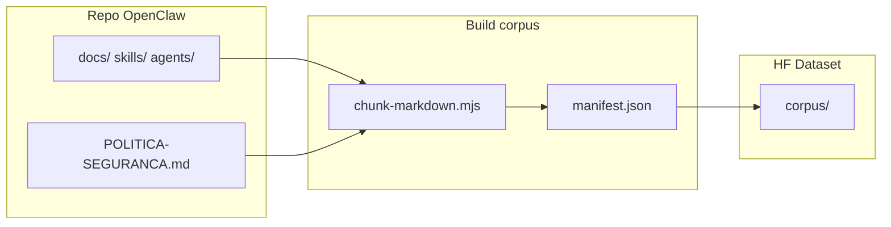

# Dataset de aprendizado — docs → memória → IA autónoma (visão)

> Ideia: comitar **documentação e artefactos curados** num Dataset HF para os agentes aprenderem melhor hoje (RAG/memória) e, no futuro, alimentar modelos **menos dependentes de APIs** de chat.

**Estado:** corpus ingest implementado (`scripts/hf-ingest-corpus.mjs`) · RAG no Space (`GET /corpus/search`, tool `search_openclaw_docs`).

---

## Objetivo em três horizontes

| Horizonte | O quê | Dependência de API |
|-----------|--------|---------------------|
| **A — Agora** | Corpus versionado no Hub; agentes **recuperam** contexto (RAG, tools, Space) | LLM + HF Dataset API para leitura |
| **B — Médio** | **Distillation** / fine-tune pequeno por cérebro (Macofel, Heimdall, …) | Treino no HF Jobs; inferência ainda API ou GPU local |
| **C — Longo** | Modelo **local** (Ollama, vLLM, GGUF) + tools mínimas | Sem OpenRouter/GPT para raciocínio; **ações** (GitHub, Telegram) podem continuar a precisar APIs |

«IA completa sem dependências» na prática significa separar:

1. **Cérebro** (linguagem, decisão, síntese) → pode ficar local com pesos próprios.
2. **Mãos** (deploy, email, catálogo Mongo) → continuam integrações até teres self-host de tudo.

O dataset serve sobretudo ao **(1)** e ao histórico do **(2)**.

---

## O que já tens (não recomeçar do zero)

| Peça | Onde |
|------|------|
| Dataset HF | `Aldebaran-LW/openclaw-backup` (`HF_BACKUP_DATASET`) |
| Inovação | `knowledge/`, `market/`, `analysis/`, `predictions/` |
| Aprendizagem episódica | `learnings/{agent}/{date}/*.jsonl` via `scripts/hf-ingest-learning.mjs` |
| Schema | `agents/dedalo/skills/design_schema.md` |
| Saídas locais | `data/innovation/`, `data/design/` → candidatas a ingest |
| Space | `hf-space/friday-prod/lib/dataset_client.py` |

Falta um ramo explícito: **`corpus/`** (documentação estável do OpenClaw).

---

## Estrutura proposta no Dataset `openclaw-backup`

```
openclaw-backup/
├── corpus/                          # NOVO — conhecimento estável (docs commitados)
│   ├── manifest.json                # índice: path, agent, tags, sha, updated_at
│   ├── openclaw-core/               # política, AGENTS, arquitetura
│   │   ├── POLITICA-SEGURANCA.md
│   │   ├── AGENTS.md
│   │   └── docs/ARQUITETURA-AGENTES.md
│   ├── ops/                         # Heimdall, deploy, cron
│   ├── macofel/                     # catálogo, APIs (sem secrets)
│   ├── innovation/                # pipeline Sophia→Gideon
│   ├── reference/                   # CREAO stubs, KILO, etc.
│   └── skills/                      # SKILL.md activos (não _creao-reference inteiro)
├── learnings/                       # episódico (já existe)
├── knowledge/ market/ analysis/ predictions/  # inovação (já existe)
└── training/                        # FUTURO — pares para fine-tune
    ├── macofel/
    ├── heimdall/
    └── shared/
```

### Formato por ficheiro em `corpus/`

Cada doc vira 1+ registos JSONL (chunking para RAG e para treino):

```json
{
  "id": "corpus:ops:CRON-HEIMDALL-FLOW:chunk-0",
  "at": "2026-06-01T12:00:00Z",
  "agent": "heimdall",
  "source": "repo:Agente_OpenClaw",
  "path": "docs/CRON-HEIMDALL-FLOW.md",
  "git_sha": "abc123",
  "tags": ["cron", "telegram", "ops"],
  "text": "… até 4000 chars por chunk …",
  "meta": { "lang": "pt", "kind": "doc", "version": 1 }
}
```

Regras (alinhado com Dédalo):

- Sem PII, sem `.env`, sem tokens, sem `Chaves/`, sem `docs/Conversas/` com dados sensíveis.
- `skills/_creao-reference/` — opcional só `manifest` + links; evitar 32× duplicar no Hub (fica no Git).

---

## Fluxo Git → Dataset (CI ou script local)



**Script:** `scripts/hf-ingest-corpus.mjs` (allowlist: `config/corpus-allowlist.txt`)

- Entrada: lista em `config/corpus-allowlist.txt` (paths permitidos).
- Saída: commit em `corpus/...` via `lib/hf-dataset-commit.mjs` (mesmo que learning).
- Opção `--dry-run` para ver chunks sem push.

**Quando correr:**

- Após merge na `main` do `Agente_OpenClaw` (GitHub Action com `HF_TOKEN` secret).
- Ou manual: `node scripts/hf-ingest-corpus.mjs` antes de sessão longa de inovação.

---

## Como cada agente usa o corpus

| Agente | Pastas corpus prioritárias | Uso |
|--------|---------------------------|-----|
| Jarvis / orchestrator | `openclaw-core/`, `ops/` | Rotas, política, visão |
| Heimdall | `ops/`, `corpus/ops/` | Cron, deploy, GitHub |
| Macofel | `macofel/` | Catálogo, status, imagens |
| Sophia / Yato / Senku / Gideon | `innovation/` + `knowledge/`… | Pesquisa + contexto interno |
| Veldora | `openclaw-core/POLITICA*` | Segurança |
| Dedalo | `manifest.json` + schema | Validar ingest |

**Hoje:** Space e scripts podem passar a ler `corpus/` com `datasets` + filtro por `agent`/`tags`.  
**Amanhã:** embedding local (sentence-transformers) ou HF Inference Embedding — índice em `corpus/index/` (parquet).

---

## Caminho até «menos API»

### Fase A — Memória rica (sem treinar modelo)

1. Allowlist de docs + ingest `corpus/`.
2. Jarvis/Space: tool `search_corpus(query, agent?)` antes de chamar OpenRouter.
3. Continuar `learnings/` para factos descobertos em runtime.

**Resultado:** menos alucinação, menos tokens repetidos, mesma API LLM.

### Fase B — Dataset de treino (`training/`)

Gerar pares a partir de:

- Conversas **curadas** (Telegram export sanitizado — só com aprovação).
- Runs bem-sucedidos (`data/innovation/*.yaml` + output).
- Pares sintéticos: `(pergunta típica Macofel, resposta script + texto corpus)`.

Formato sugerido (JSONL):

```json
{
  "messages": [
    { "role": "system", "content": "És o cérebro Macofel. Obedece POLITICA-SEGURANCA." },
    { "role": "user", "content": "quantos pending?" },
    { "role": "assistant", "content": "… resposta gold …" }
  ],
  "meta": { "agent": "macofel", "source": "script-gold" }
}
```

Treino: HF Jobs / LoRA 7B–8B por domínio — **não** substitui política de segurança hardcoded.

### Fase C — Inferência local

- Export GGUF; `OLLAMA_MODEL` ou vLLM na EC2.
- Router: tarefas simples → modelo local; complexas → OpenRouter (fallback).
- Corpus + LoRA = «personalidade + factos» do portfólio Aldebaran.

---

## O que comitar no Git vs só no Dataset

| Conteúdo | Git `Agente_OpenClaw` | Dataset `corpus/` |
|----------|----------------------|-------------------|
| `docs/*.md` operacionais | Sim | Sim (sync) |
| `skills/*/SKILL.md` activos | Sim | Sim (sync) |
| `agents/*/AGENTS.md` | Sim | Sim (sync) |
| `POLITICA-SEGURANCA.md` | Sim | Sim |
| `docs/Conversas/` | Opcional (histórico Cursor) | **Não** (ruído + risco) |
| `.env`, `Chaves/` | **Nunca** | **Nunca** |
| `skills/_creao-reference/` | Sim (arquivo) | Só manifest ou skip |
| `data/innovation/*` | Git opcional | `knowledge/` etc. já vão |

**Dois repositórios de verdade:**

- **Git** = fonte editável, PR, review.
- **Dataset** = snapshot para máquinas/agentes consumirem + histórico de aprendizado.

---

## Segurança e política

- Ingest automático **nunca** inclui ficheiros do `.gitignore` de secrets.
- Scrubber: regex para `hf_`, `sk-`, `Bearer`, emails pessoais antes do commit HF.
- Fine-tune **não** remove `POLITICA-SEGURANCA.md` do runtime — regras hardcoded no gateway permanecem.
- Pagamentos e PII: proibição absoluta inalterada.

---

## Próximos passos (quando quiseres implementar)

1. `config/corpus-allowlist.txt` — lista inicial de ~20 docs.
2. `scripts/hf-ingest-corpus.mjs` — chunk + manifest + commit.
3. Entrada em `agents/dedalo/skills/design_schema.md` — secção `corpus/`.
4. Tool no `friday-prod` ou gateway: `GET /corpus/search?q=`.
5. (Opcional) GitHub Action `sync-corpus-to-hf.yml` on push `docs/**`.

Pedir ao Lucas antes de: Action automática na org, aumento grande do Dataset, ou export de chats Telegram para `training/`.

---

## Referências internas

- `docs/ARQUITETURA-INOVACAO.md` — pipeline inovação + Dataset
- `docs/INOVACAO-FASE-2.md` — Space + variáveis
- `agents/dedalo/skills/design_schema.md` — JSONL learnings
- `scripts/hf-ingest-learning.mjs` — ingest episódico
- `docs/CREAO-REFERENCIA-COMPLETA.md` — arquivo externo (corpus/reference)
