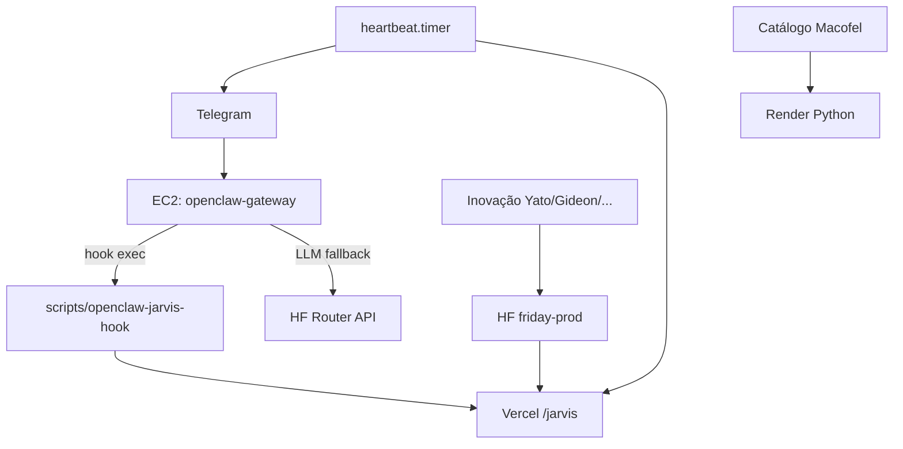

# EC2 mínima — só o essencial (transição para servidor físico)

A EC2 é um **nó temporário**: Telegram + gateway OpenClaw + heartbeat. Tudo o resto (inovação, dashboards, catálogo, memória longa) fica em **Vercel**, **Hugging Face** e **Render**.

Quando migrares para o **servidor físico**, repetes o mesmo perfil: copias `/opt/openclaw`, `.env`, `openclaw.json` e os dois serviços systemd.

---

## O que fica na EC2 (essencial)

| Componente | Serviço | Função |
|------------|---------|--------|
| **OpenClaw gateway** | `openclaw-gateway` | Bot Telegram, hook Jarvis, sessões |
| **Heartbeat** | `openclaw-heartbeat.timer` | Disco, gateway up, alertas Telegram |
| **Repo** | `/opt/openclaw` | Scripts + skills Jarvis (~5 MB) |
| **Config** | `/root/.openclaw/openclaw.json` | Só agente **orchestrator** (Jarvis) |
| **Secrets** | `/opt/openclaw/.env` | Ver secção abaixo |



---

## O que **não** fica na EC2

| Remover / não instalar | Motivo |
|------------------------|--------|
| **Ollama** + modelos locais | ~700 MB; inferência via HF/Groq |
| **~/macofel/.venv** | Catálogo é Render, não EC2 |
| **openclaw-telegram-jarvis-bridge --poll** | Duplica `getUpdates` com o gateway |
| **ClawMetry** (`:8900`) | Dashboard; opcional no PC com túnel |
| **Forge** (`:8787`) | Visual; PC + túnel SSH |
| **nginx + orchestrate hook** (`:443`) | Só se Vercel precisar webhook EC2 |
| **12 agentes** no `openclaw.json` | Inovação no HF; EC2 só **orchestrator** |
| **snapd** (se não usas snaps) | ~200 MB |
| **Docker** na EC2 | Só se não usas containers aí |

---

## `.env` mínimo na EC2

```env
# Telegram (obrigatório)
TELEGRAM_BOT_TOKEN=
TELEGRAM_ADMIN_CHAT_ID=

# Gateway Vercel (comandos operacionais Jarvis)
OPENCLAW_GATEWAY_BASE_URL=https://openclaw.lwdigitalforge.com
OPENCLAW_AUTOMATION_TOKEN=

# LLM do orchestrator (pelo menos um)
HF_TOKEN=
GROQ_API_KEY=
DEEPSEEK_API_KEY=
# OPENCLAW_LLM_PRIMARY=groq   # enquanto HF Inference 402

# Heartbeat
HEARTBEAT_CHECK_HEIMDALL_FLOW=1
HEARTBEAT_AGENT_STALE_MIN=60

# Inovação no HF (heartbeat/gateway chamam remoto — não correm na EC2)
HF_FRIDAY_PROD_URL=https://aldebaran-lw-friday-prod.hf.space
HF_BACKUP_DATASET=Aldebaran-LW/openclaw-backup
```

**Não precisas na EC2:** `MONGODB_URI`, keys Macofel, OpenRouter (removido), paths do Drive `G:\`.

---

## Aplicar perfil mínimo (uma vez)

**Do PC:**

```powershell
cd "H:\Meu Drive\Projetos\OpenClaw"
git pull
.\scripts\ec2-sync-from-pc.ps1
```

Na EC2 o `ec2-sync-now.sh` corre cleanup + git pull + `ec2-fix-telegram-models` (com patch **minimal** se `EC2_PROFILE=minimal` no `.env`).

**Ou só slim (sem git):**

```bash
cd /opt/openclaw
sudo EC2_PROFILE=minimal bash scripts/ec2-slim-essential.sh
```

---

## Disco (~8 GB → confortável)

1. `sudo bash scripts/ec2-slim-essential.sh` (venv Macofel, Ollama, serviços opcionais)
2. **EBS 16 GB** no AWS Console (recomendado até ter servidor físico) — `docs/EC2-DISCO.md`
3. Backup learnings → HF: `node scripts/hf-backup-upload.mjs` (dados, não libertam GB na EC2)

---

## Migração futura → servidor físico

| Passo | Acção |
|-------|--------|
| 1 | Servidor com Ubuntu 22.04+, Node 22, Python 3 |
| 2 | `git clone` → `/opt/openclaw`, copiar `.env` da EC2 |
| 3 | `openclaw onboard` ou copiar `/root/.openclaw/openclaw.json` |
| 4 | `EC2_PROFILE=minimal bash scripts/ec2-slim-essential.sh` |
| 5 | systemd: `openclaw-gateway` + `openclaw-heartbeat.timer` (mesmos unit files) |
| 6 | DNS/Telegram: mesmo bot; security group / firewall só SSH + nada público além do que precisares |
| 7 | Desligar EC2 após validar Telegram + heartbeat 24 h |

**Mantém na cloud:** Vercel (gateway HTTP), HF (Spaces + dataset), Render (Macofel).

---

## Checklist pós-slim

```bash
systemctl is-active openclaw-gateway openclaw-heartbeat.timer
df -h /
cd /opt/openclaw && node scripts/openclaw-jarvis-hook.mjs ajuda
```

Telegram: `/new` → `ajuda` → `resumo portfolio`

---

Ver também: `docs/EC2-DISCO.md` · `docs/ROADMAP-RENDER-PARA-HF.md` · `docs/OPENCLAW-JARVIS-INTEGRACAO.md`
