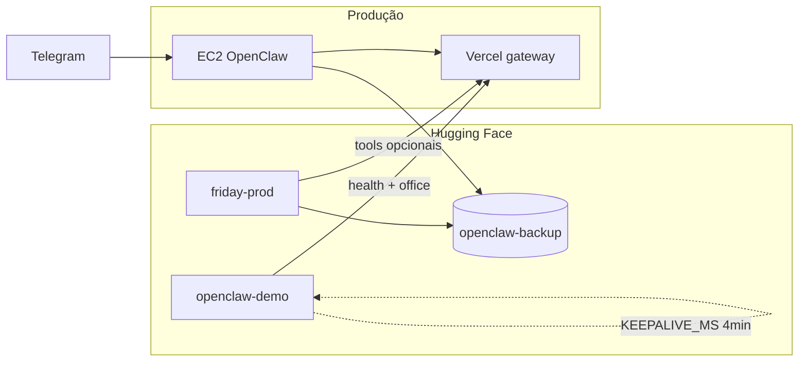

# Deploy F.R.I.D.A.Y. no Hugging Face

Guia único para os dois Spaces OpenClaw no HF: **demo** (monitor) e **friday-prod** (protótipo smolagents).

Não substitui **EC2** (Jarvis/Telegram) nem **Vercel** (gateway). Ver `POLITICA-SEGURANCA.md` e `docs/ROADMAP-RENDER-PARA-HF.md`.

---

## Arquitetura



| Componente | Space HF | Função |
|------------|----------|--------|
| Monitor portfólio | `Aldebaran-LW/openclaw-demo` | Dashboard 4 cérebros, proxy `/openclaw/office/status` |
| Protótipo agentes | `Aldebaran-LW/friday-prod` (criar) | smolagents + `agents-config.yaml` |
| Memória / backup | Dataset `Aldebaran-LW/openclaw-backup` | `hf-ingest-learning.mjs`, `sync.py` |

Aliases Forge (visual): `orchestrator→friday`, `ops→byte`, `vp-pecas→pixel`, `macofel→lala`.

---

**Deploy rápido:** [DEPLOY-HF-AGORA.md](./DEPLOY-HF-AGORA.md) · script `scripts/hf-deploy-space.ps1`

## Pré-requisitos

1. Conta/org [Aldebaran-LW](https://huggingface.co/Aldebaran-LW) no HF.
2. `.env` na raiz do repo (ver `docs/HUGGINGFACE-SPACES.md`):

```env
HF_TOKEN=
HF_SPACE_REPO=Aldebaran-LW/openclaw-demo
HF_FRIDAY_SPACE_REPO=Aldebaran-LW/friday-prod
HF_BACKUP_DATASET=Aldebaran-LW/openclaw-backup
OPENCLAW_GATEWAY_BASE_URL=https://seu-gateway.vercel.app
OPENCLAW_AUTOMATION_TOKEN=
OPENROUTER_API_KEY=
```

3. Gateway Vercel em produção com rotas `/api/health` e `/openclaw/office/status`.

---

## Parte A — Space demo (`openclaw-demo`)

### 1. Criar ou usar o Space

- SDK: **Docker**, privado recomendado.
- Repo: `hf-space/demo/` neste projeto.

### 2. Secrets no Space

| Nome | Tipo | Obrigatório |
|------|------|-------------|
| `OPENCLAW_GATEWAY_BASE_URL` | Secret | Sim (para `/gateway` e painel) |
| `OPENCLAW_AUTOMATION_TOKEN` | Secret | Sim |

Automático no PC:

```powershell
cd "H:\Meu Drive\Projetos\OpenClaw"
node scripts/hf-configure-space.mjs
```

### 3. Deploy do código

```powershell
git clone https://huggingface.co/spaces/Aldebaran-LW/openclaw-demo
Copy-Item -Recurse "H:\Meu Drive\Projetos\OpenClaw\hf-space\demo\*" .\openclaw-demo\
cd openclaw-demo
git add .
git commit -m "Atualizar demo OpenClaw com painel 4 cerebros"
git push
```

### 4. Rotas

| Rota | Descrição |
|------|-----------|
| `/` | Painel HTML — 4 cérebros, refresh 60s |
| `/health` | Health local (monitor externo opcional) |
| `/api/status` | JSON agregado (demo + gateway + office) |
| `/gateway` | JSON legado (compatível) |

**Keepalive interno (padrão):** `KEEPALIVE_MS=240000` (4 min) — o servidor chama `buildStatus()` em loop e mantém o processo activo. Definido no `Dockerfile`; `0` desliga.

### 5. Monitorização externa (opcional)

Não é obrigatório para o painel `/`. Usa só se quiseres **alerta** quando o Space cair.

| Método | Custo | URL / comando |
|--------|-------|----------------|
| **Keepalive interno** | 0 | Já activo (`KEEPALIVE_MS`) |
| **[cron-job.org](https://cron-job.org)** | 0 | GET `https://aldebaran-lw-openclaw-demo.hf.space/health` a cada 5 min |
| **Cron na EC2** | 0 | `*/5 * * * * curl -sf -m 15 "https://aldebaran-lw-openclaw-demo.hf.space/health"` |
| **GitHub Actions** | 0 (repo público) | `schedule: '*/5 * * * *'` + `curl` |

Evita ping agressivo só para “acordar” Space free — pode ser frágil face às políticas do HF. O keepalive interno costuma chegar para o demo.

---

## Parte B — Space friday-prod (protótipo)

### 1. Criar Space

- [new-space](https://huggingface.co/new-space?sdk=docker) → nome `friday-prod`, **Private**.
- Código fonte: `hf-space/friday-prod/`.

### 2. Regenerar config dos agentes

Sempre que alterar `agents/*/config.yaml`:

```powershell
node scripts/generate-hf-agents-config.mjs
```

Gera `hf-space/friday-prod/agents-config.yaml` (4 cérebros + skills + tools stub).

### 3. Secrets no Space friday-prod

| Nome | Uso |
|------|-----|
| `OPENROUTER_API_KEY` | LLM via OpenRouter (recomendado) |
| `HF_TOKEN` | Fallback Inference API HF |
| `OPENCLAW_GATEWAY_BASE_URL` | Tools Ops/VP reais |
| `OPENCLAW_AUTOMATION_TOKEN` | Bearer gateway |
| `HF_BACKUP_DATASET` | Variable: `Aldebaran-LW/openclaw-backup` |

### 4. Deploy

```powershell
git clone https://huggingface.co/spaces/Aldebaran-LW/friday-prod
Copy-Item -Recurse "H:\Meu Drive\Projetos\OpenClaw\hf-space\friday-prod\*" .\friday-prod\
cd friday-prod
git add .
git commit -m "Deploy prototipo F.R.I.D.A.Y. smolagents"
git push
```

### 5. API do protótipo

| Método | Rota | Corpo |
|--------|------|-------|
| GET | `/health` | — |
| GET | `/agents` | Lista agentes do YAML |
| POST | `/run` | `{"task":"...", "agent_id":"macofel"}` |
| POST | `/run/{agent_id}` | `{"task":"..."}` |

Sem `OPENROUTER_API_KEY` nem `HF_TOKEN`, responde em modo **stub** (útil para validar deploy).

### 6. Estrutura

```
hf-space/friday-prod/
├── Dockerfile
├── app.py              # FastAPI + Orquestrador
├── agents-config.yaml  # gerado
├── sync.py             # backup Dataset
├── requirements.txt
└── tools/
    ├── macofel_tools.py
    ├── ops_tools.py
    └── vp_pecas_tools.py
```

Tools no Hub (`load_tool("Aldebaran-LW/...")`): fase futura — hoje tools locais + gateway.

---

## Parte C — Dataset e aprendizagem

1. Dataset privado: [openclaw-backup](https://huggingface.co/datasets/Aldebaran-LW/openclaw-backup).
2. Do PC:

```powershell
node scripts/hf-ingest-learning.mjs --agent macofel --text "nota relevante"
node scripts/hf-backup-upload.mjs
```

3. Do Space friday-prod: `sync.append_learning(agent, text)` em `sync.py` (integrar após `/run` quando quiseres persistência automática).

---

## Scripts úteis

| Script | Função |
|--------|--------|
| `scripts/test-hf-token.mjs` | Valida `HF_TOKEN` |
| `scripts/hf-configure-space.mjs` | Secrets no openclaw-demo |
| `scripts/generate-hf-agents-config.mjs` | YAML → friday-prod |
| `scripts/hf-ingest-learning.mjs` | Aprendizagem → Dataset |
| `scripts/hf-backup-upload.mjs` | Snapshot gateway → Dataset |

---

## O que NÃO fazer no HF

- Não colocar `MONGODB_URI` no Space friday-prod (catálogo só via gateway/EC2).
- Não expor `.env` no Git do Space.
- Não tratar o Space como produção Telegram — aprovações continuam na EC2.
- Pagamentos e PII: `POLITICA-SEGURANCA.md`.

---

## Checklist rápido

- [ ] Space `openclaw-demo` com secrets gateway
- [ ] Push `hf-space/demo/` (keepalive interno activo; monitor externo opcional)
- [ ] Painel `/` mostra 4 cérebros
- [ ] Space `friday-prod` criado (opcional)
- [ ] `generate-hf-agents-config.mjs` + push friday-prod
- [ ] `OPENROUTER_API_KEY` no friday-prod para LLM real
- [ ] Dataset `openclaw-backup` + teste `hf-ingest-learning.mjs`

---

## Ver também

- `docs/HUGGINGFACE-SPACES.md` — URLs e variáveis resumidas
- `docs/ARQUITETURA-AGENTES.md` — cérebros EC2
- `docs/GATEWAY-VERCEL.md` — API produção
