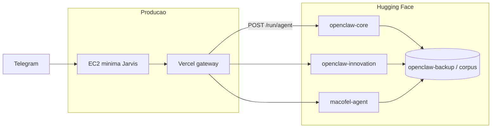

# Deploy OpenClaw no Hugging Face (3 perfis)

Guia dos **Spaces HF por domínio lógico** — substitui o modelo antigo de Space único `friday-prod`.

Não substitui **EC2 mínima** (Jarvis/Telegram) nem **Vercel** (gateway). Ver `POLITICA-SEGURANCA.md` e `docs/EC2-MINIMAL.md`.

Mapa completo: `docs/MAPAS-RESIDENCIAS.md` · perfis em `config/hf-space-profiles.yaml`.

---

## Arquitetura



| Perfil | Repo HF | Agentes |
|--------|---------|---------|
| **core** | `Aldebaran-LW/openclaw-core` | heimdall, vp-pecas, veldora, rimuru, dedalo, icaro |
| **innovation** | `Aldebaran-LW/openclaw-innovation` | sophia, yato, senku, gideon, hefestos, rebeca |
| **macofel** | `Aldebaran-LW/macofel-agent` | macofel (instância separada) |

| Legado | Repo | Notas |
|--------|------|--------|
| ~~friday-prod~~ | `Aldebaran-LW/friday-prod` | Substituído pelos 3 perfis; pode ficar em sleep |
| ~~openclaw-demo~~ | `Aldebaran-LW/openclaw-demo` | Monitor legado |

Template de código: `hf-space/friday-prod/` → montado por perfil com `hf-assemble-space.mjs`.

---

**Deploy rápido:** [DEPLOY-HF-AGORA.md](./DEPLOY-HF-AGORA.md)

## Pré-requisitos

1. Org [Aldebaran-LW](https://huggingface.co/Aldebaran-LW) no HF.
2. `.env` na raiz (ver `docs/HUGGINGFACE-SPACES.md`):

```env
HF_TOKEN=
HF_USERNAME=Aldebaran-LW
HF_BACKUP_DATASET=Aldebaran-LW/openclaw-backup
HF_CORPUS_DATASET=Aldebaran-LW/openclaw-backup
HF_OPENCLAW_CORE_URL=https://aldebaran-lw-openclaw-core.hf.space
HF_OPENCLAW_INNOVATION_URL=https://aldebaran-lw-openclaw-innovation.hf.space
HF_MACOFEL_SPACE_URL=https://aldebaran-lw-macofel-agent.hf.space
OPENCLAW_GATEWAY_BASE_URL=https://openclaw.lwdigitalforge.com
OPENCLAW_AUTOMATION_TOKEN=
OPENROUTER_API_KEY=
```

3. Gateway Vercel com `HF_OPENCLAW_*_URL` em `gateway/vercel.json` + painel.

---

## Fluxo de deploy

### 1. Regenerar config dos agentes

```powershell
node scripts/generate-hf-agents-config.mjs --profile core
node scripts/generate-hf-agents-config.mjs --profile innovation
node scripts/generate-hf-agents-config.mjs --profile macofel
```

### 2. Montar pasta do Space (a partir do template)

```powershell
node scripts/hf-assemble-space.mjs --profile core
node scripts/hf-assemble-space.mjs --profile innovation
node scripts/hf-assemble-space.mjs --profile macofel
```

### 3. Push + secrets

```powershell
node scripts/hf-deploy-space.mjs --profile core --secrets
node scripts/hf-deploy-space.mjs --profile innovation --secrets
node scripts/hf-deploy-space.mjs --profile macofel --secrets
```

### 4. Corpus (RAG)

```powershell
node scripts/hf-ingest-corpus.mjs
```

Lista de ficheiros: `config/corpus-allowlist.txt`. Doc: `docs/DATASET-APRENDIZADO-AGENTES.md`.

---

## Secrets por Space (todos os perfis)

| Nome | Uso |
|------|-----|
| `OPENROUTER_API_KEY` | LLM smolagents / chat |
| `HF_TOKEN` | Dataset, inference fallback |
| `OPENCLAW_GATEWAY_BASE_URL` | Tools que chamam Vercel |
| `OPENCLAW_AUTOMATION_TOKEN` | Auth gateway |
| `KILO_API_KEY` | Hefestos (innovation) |
| `HF_CORPUS_DATASET` | RAG corpus (variable) |
| `HF_LEARNING_AUTO` | `true` — episódios no Dataset |

**Não** colocar `MONGODB_URI` nos Spaces — catálogo via gateway.

---

## Endpoints (cada Space)

| Rota | Função |
|------|--------|
| `GET /health` | `space_profile`: core \| innovation \| macofel |
| `GET /` | Painel dashboard |
| `POST /run/{agent_id}` | Executar agente |
| `GET /corpus/search` | RAG keyword |

Gateway Vercel encaminha: `POST /openclaw/orchestrate` → `{HF_*_URL}/run/{agent}`.

---

## Vercel

```powershell
node scripts/vercel-sync-hf-env.mjs
```

Deploy gateway: **push para `main`** (Root Directory `gateway/`). Ver `docs/GATEWAY-VERCEL.md`.

Smoke test:

```powershell
node scripts/test-hf-spaces-routing.mjs
```

---

## Scripts úteis

| Script | Função |
|--------|--------|
| `scripts/hf-assemble-space.mjs` | Template → `hf-space/{profile}/` |
| `scripts/hf-deploy-space.mjs` | Git push Hub + secrets |
| `scripts/generate-hf-agents-config.mjs` | `agents/*/config.yaml` → YAML |
| `scripts/hf-ingest-corpus.mjs` | Docs → Dataset `corpus/` |
| `scripts/vercel-sync-hf-env.mjs` | Env HF → projeto Vercel |

---

## Checklist

- [x] 3 Spaces privados (Docker) no Hub
- [x] Vercel: `HF_OPENCLAW_CORE_URL`, `HF_OPENCLAW_INNOVATION_URL`, `HF_MACOFEL_SPACE_URL`
- [x] EC2 mínima: só orchestrator
- [ ] Corpus actualizado após mudanças em docs/skills
- [ ] `friday-prod` em sleep (opcional)

---

## Ver também

- [MAPAS-RESIDENCIAS.md](./MAPAS-RESIDENCIAS.md)
- [DATASET-APRENDIZADO-AGENTES.md](./DATASET-APRENDIZADO-AGENTES.md)
- [EC2-MINIMAL.md](./EC2-MINIMAL.md)
- [GATEWAY-VERCEL.md](./GATEWAY-VERCEL.md)
