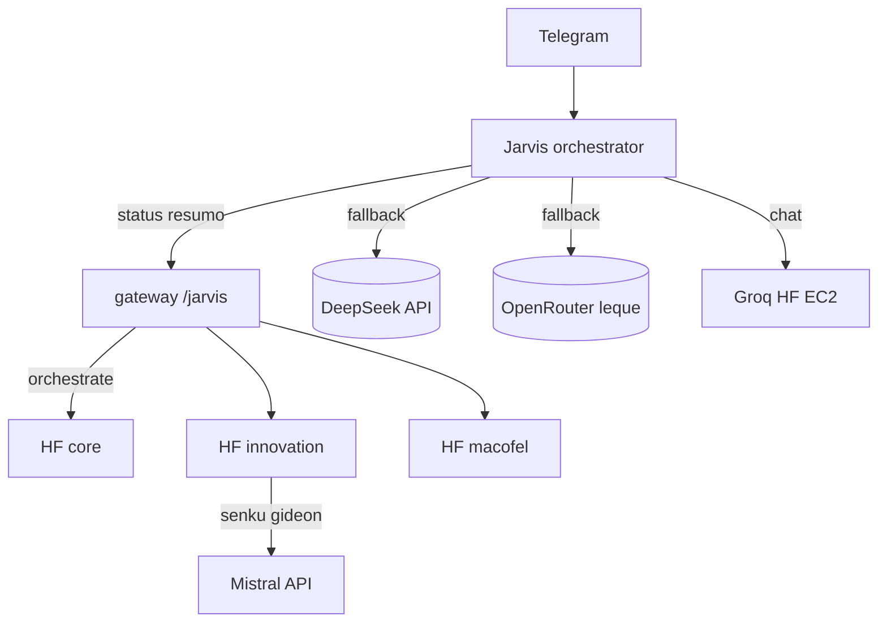

# Leque de IAs — tokens gratuitos por assunto

Estratégia: **maximizar cotas free** repartindo provedores e modelos por cérebro, com **uma voz Jarvis** (PT-BR, política única).

Relacionado: [DEEPSEEK-API.md](./DEEPSEEK-API.md) · [OPENROUTER-MODELOS-FREE.md](./OPENROUTER-MODELOS-FREE.md) · [MAPAS-RESIDENCIAS.md](./MAPAS-RESIDENCIAS.md) · [ARQUITETURA-INOVACAO.md](./ARQUITETURA-INOVACAO.md)

---

## Princípios

| Regra | Detalhe |
|-------|---------|
| **Scripts primeiro** | Status Macofel, GitHub, deploy → gateway Vercel / cron — **zero LLM** |
| **Groq / HF na EC2** | Só **Jarvis** (orchestrator) na EC2 mínima — ver [EC2-MINIMAL.md](./EC2-MINIMAL.md) |
| **Infron** | Fallback EC2 (`INFRON_API_KEY`) após HF Router |
| **Groq** | Fallback EC2 (`GROQ_API_KEY`) — ver [GROQ-API.md](./GROQ-API.md) |
| **Kilo Gateway** | HF `openclaw-innovation` — **Hefestos** (`kilo-auto/free`) |
| **Mistral** | **Senku, Gideon** no Space innovation (`MISTRAL_API_KEY`) |
| **API directa opcional** | DeepSeek → `DEEPSEEK_API_KEY` (402 se sem saldo) |
| **HF Inference Router** | `HF_TOKEN` + providers HF → fallback complexo Telegram |
| **Mesma linha de raciocínio** | `agents/_shared/VOZ-JARVIS.md` + `POLITICA-SEGURANCA.md` em todos |
| **HF = laboratório** | Sophia/Rebeca/Senku/Hefestos no Space; copiar padrões úteis para EC2/scripts |

---

## Camadas (ordem de custo)

```
1. scripts + POST /jarvis     → 0 tokens
2. Groq/HF/DeepSeek (EC2)     → só Jarvis (Telegram)
3. OpenRouter free (HF)       → agentes nos 3 Spaces
4. Mistral directa            → Senku, Gideon (innovation)
5. Pago                       → só pedido explícito do Lucas
```

---

## Mapa cérebro → provedor → modelo

Definição em `agents/<id>/config.yaml`. Aplicar na EC2: `scripts/ec2-apply-agent-config.sh`.

| Cérebro | Assunto | Provedor | Modelo (primary) |
|---------|---------|----------|------------------|
| **orchestrator** (Jarvis / Telegram) | Simples / complexo | ollama → deepseek → hf | `smollm2:360m` → `deepseek-v4-flash` → `Qwen2.5-7B:fastest` |
| **heimdall, vp-pecas, veldora…** | Ops / monitor | openrouter (HF core) | `google/gemma-4-26b-a4b-it:free` ou leque free |
| **sophia, yato, rebeca, hefestos** | Inovação | openrouter / kilo | leque free; Hefestos `kilo-auto/free` |
| **senku, gideon** | Análise / predição | **mistral** | `mistral-small-latest` (`MISTRAL_API_KEY`) |
| **macofel** | Catálogo | openrouter (HF macofel-agent) | `google/gemma-4-26b-a4b-it:free` + tools gateway |

**Jarvis (EC2):** Groq → Infron → DeepSeek → HF Router. **Agentes HF:** não usam Ollama EC2.

**Telegram:** operacional → gateway (zero LLM). Conversa → stack Jarvis na EC2; agentes especializados via `POST /openclaw/orchestrate` → HF.

> **DeepSeek** (`DEEPSEEK_API_KEY`): [api-docs.deepseek.com](https://api-docs.deepseek.com/) — requer saldo (402 se esgotado). **HF Router** cobre fallback complexo com `HF_TOKEN` + [Inference Providers](https://huggingface.co/settings/inference-providers).

---

## Chaves no `.env` (EC2)

```env
# Directas (quotas separadas)
DEEPSEEK_API_KEY=sk-...
GOOGLE_API_KEY=...          # opcional; evitar gemini-3.x pago

# Leque OpenRouter
OPENROUTER_API_KEY=sk-or-v1-...

# Fase 2: chave OR por cérebro (mais isolamento de rate limit)
# OPENROUTER_OPS_KEY=
# OPENROUTER_MACOFEL_KEY=

# HF (inovação, não Telegram)
HF_TOKEN=hf_...
```

Ver `agents/*/config.yaml` → campo `env_key` por cérebro.

---

## Mesma voz, IAs diferentes

Todos os cérebros partilham:

- `POLITICA-SEGURANCA.md`
- `agents/_shared/VOZ-JARVIS.md` (tom PT, curto, sem secrets)
- Orquestrador **agrega** respostas numa mensagem Telegram

O LLM muda; a **persona Jarvis** e as **aprovações** não mudam.

---

## Hugging Face (3 perfis)

| Space | Agentes | LLM típico |
|-------|---------|------------|
| `openclaw-core` | Heimdall, VP, Veldora, Rimuru… | OpenRouter free |
| `openclaw-innovation` | Sophia, Yato, Senku, Gideon, Hefestos… | OpenRouter / Mistral / Kilo |
| `macofel-agent` | Macofel | OpenRouter + tools catálogo |

Template: `hf-space/friday-prod/` → `node scripts/hf-assemble-space.mjs --profile <id>`.

Corpus RAG: `node scripts/hf-ingest-corpus.mjs` → Dataset `corpus/`.

**Não** ligar Telegram directo ao HF. Vercel **orquestra** via `POST /openclaw/orchestrate`.

Legado: `friday-prod`, `openclaw-demo` — substituídos pelos perfis acima.

---

## Diagrama



---

## Aplicar na EC2 (mínima)

```bash
cd /opt/openclaw
git pull
# .env: OPENCLAW_GATEWAY_BASE_URL + GROQ/HF/DEEPSEEK para Jarvis
sudo bash scripts/ec2-sync-now.sh   # EC2_PROFILE=minimal por defeito
```

Telegram: `/new` → `ajuda`

---

## Evolução (fase 2)

- `OPENROUTER_<CEREBRO>_KEY` no `.env` — rate limit isolado por agente
- Roteador automático: 429 num provedor → próximo do leque (sem Gemini pago)
- Supabase: histórico + aprovações ([SUPABASE-CENTRAL.md](./SUPABASE-CENTRAL.md))
