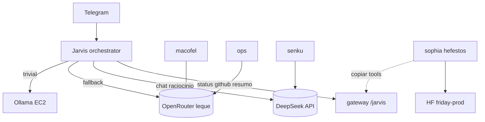

# Leque de IAs — tokens gratuitos por assunto

Estratégia: **maximizar cotas free** repartindo provedores e modelos por cérebro, com **uma voz Jarvis** (PT-BR, política única).

Relacionado: [DEEPSEEK-API.md](./DEEPSEEK-API.md) · [OPENROUTER-MODELOS-FREE.md](./OPENROUTER-MODELOS-FREE.md) · [MAPAS-RESIDENCIAS.md](./MAPAS-RESIDENCIAS.md) · [ARQUITETURA-INOVACAO.md](./ARQUITETURA-INOVACAO.md)

---

## Princípios

| Regra | Detalhe |
|-------|---------|
| **Scripts primeiro** | Status Macofel, GitHub, deploy → gateway Vercel / cron — **zero LLM** |
| **Uma chave ≠ um modelo** | Cada **provedor** (DeepSeek, Google, OpenRouter…) tem quota própria |
| **OpenRouter = leque** | Uma `OPENROUTER_API_KEY` → dezenas de modelos `:free` |
| **API directa quando fizer sentido** | DeepSeek chat → `DEEPSEEK_API_KEY` + `api.deepseek.com` (não gastar slot OpenRouter) |
| **Partição por assunto** | Cada cérebro usa **modelo + chave** diferentes → mais pedidos/dia no total |
| **Mesma linha de raciocínio** | `agents/_shared/VOZ-JARVIS.md` + `POLITICA-SEGURANCA.md` em todos |
| **HF = laboratório** | Sophia/Rebeca/Senku/Hefestos no Space; copiar padrões úteis para EC2/scripts |

---

## Camadas (ordem de custo)

```
1. scripts + POST /jarvis     → 0 tokens
2. Ollama (EC2)               → 0 API externa
3. APIs directas (free tier)  → DEEPSEEK_API_KEY, GOOGLE_API_KEY, …
4. OpenRouter :free           → um leque por chave
5. HF Spaces (inovação)       → HF_TOKEN + modelos hosted
6. Pago                       → só pedido explícito do Lucas
```

---

## Mapa cérebro → provedor → modelo

Definição em `agents/<id>/config.yaml`. Aplicar na EC2: `scripts/ec2-apply-agent-config.sh`.

| Cérebro | Assunto | Provedor | Chave `.env` | Modelo (primary) | Fallback |
|---------|---------|----------|--------------|------------------|----------|
| **orchestrator** (Jarvis / Telegram) | Chat, delegação | **openrouter** | `OPENROUTER_API_KEY` | `deepseek/deepseek-v4-flash:free` | MiniMax / gpt-oss-20b free |
| **senku** / **dedalo** | Viabilidade, schema | openrouter | `OPENROUTER_API_KEY` | `deepseek/deepseek-v4-flash:free` | Nemotron free |

**Telegram:** face pública = **orchestrator** (OpenRouter `deepseek-v4-flash:free`). Pedidos operacionais → skill `openclaw-jarvis` (gateway, sem LLM).

> **DeepSeek directo** (`DEEPSEEK_API_KEY`): usar só com saldo em [platform.deepseek.com](https://platform.deepseek.com). Sem créditos → erro 402; manter OpenRouter free como primary.

---

## Chaves no `.env` (EC2)

```env
# Directas (quotas separadas)
DEEPSEEK_API_KEY=sk-...
GOOGLE_API_KEY=...          # opcional; evitar gemini-3.x pago

# Leque OpenRouter
OPENROUTER_API_KEY=sk-or-v1-...

# Fase 2: chave OR por cérebro (mais isolamento de rate limit)
# OPENROUTER_OPS_KEY=
# OPENROUTER_MACOFEL_KEY=

# HF (inovação, não Telegram)
HF_TOKEN=hf_...
```

Ver `agents/*/config.yaml` → campo `env_key` por cérebro.

---

## Mesma voz, IAs diferentes

Todos os cérebros partilham:

- `POLITICA-SEGURANCA.md`
- `agents/_shared/VOZ-JARVIS.md` (tom PT, curto, sem secrets)
- Orquestrador **agrega** respostas numa mensagem Telegram

O LLM muda; a **persona Jarvis** e as **aprovações** não mudam.

---

## Hugging Face (copiar, não depender)

| O que está no HF | Uso |
|------------------|-----|
| `hf-space/friday-prod` | Pipeline Sophia→Hefestos (smolagents) |
| `hf-space/demo` | Monitor 4 cérebros |
| Spaces públicos (RAG, tools) | Sophia **pesquisa** → Senku decide → portar tool stub para `scripts/` ou EC2 |

**Não** ligar Telegram directo ao HF (latência, cold start). Friday Vercel **orquestra** via `POST /openclaw/orchestrate`.

Padrões a copiar: tools em `hf-space/friday-prod/tools/` → equivalente gateway/skills.

---

## Diagrama



---

## Aplicar na EC2

```bash
cd /opt/openclaw
git pull
# .env com DEEPSEEK_API_KEY + OPENROUTER_API_KEY
sudo bash scripts/ec2-apply-agent-config.sh
sudo bash scripts/ec2-fix-telegram-models.sh   # emergência quota Gemini
sudo systemctl restart openclaw-gateway
```

Telegram: `/new` → `ajuda`

---

## Evolução (fase 2)

- `OPENROUTER_<CEREBRO>_KEY` no `.env` — rate limit isolado por agente
- Roteador automático: 429 num provedor → próximo do leque (sem Gemini pago)
- Supabase: histórico + aprovações ([SUPABASE-CENTRAL.md](./SUPABASE-CENTRAL.md))
