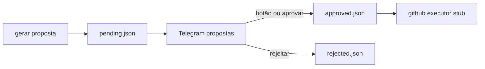

# Pipeline de propostas (v1 — simulado)

HF / scripts geram **proposta** → Lucas aprova no Telegram → **GitHub simulado** (console).

## Ficheiros

| Ficheiro | Função |
|----------|--------|
| `scripts/hf/proposal-generator.mjs` | `generateProposal(type, context)` |
| `scripts/hf/proposal-approval.mjs` | Fila pending / approved / rejected |
| `scripts/github/executor.mjs` | `createIssue` / `createPullRequest` (stub) |
| `data/proposals-*.json` | Persistência local |

## Comandos Telegram

```text
gerar proposta manutenção
gerar proposta innovation tema catalogo
propostas                    # lista + botões ✅/❌
aprovar proposta <id>
rejeitar proposta <id> motivo opcional
```

## Fluxo



Próximo passo: ligar `generateProposal` a saída real do HF Space; substituir stub por `GITHUB_TOKEN` com gate `sim`.

Ver [VISAO-PRODUTO.md](./VISAO-PRODUTO.md).
