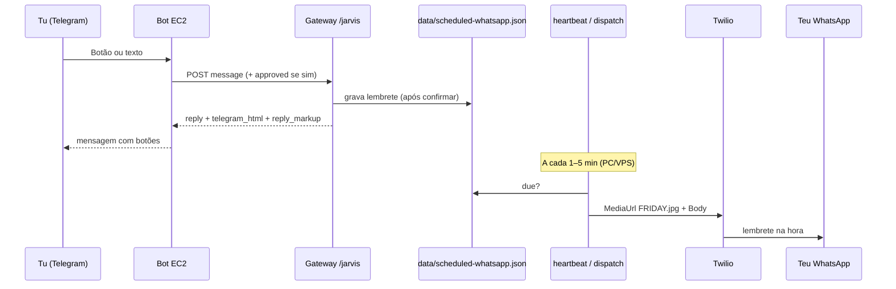

# Fluxo Telegram → Jarvis → WhatsApp

## Visão geral



## Onde corre cada peça

| Peça | Onde | Função |
|------|------|--------|
| Bot Telegram | **EC2** (OpenClaw) | Recebe mensagens e `callback_query` |
| Jarvis | **Vercel** `POST /jarvis` | Roteia, agenda, devolve HTML + teclado |
| Dispatcher | **PC/VPS** `heartbeat.py` | Envia lembretes vencidos via Twilio |
| Imagem FRIDAY | Supabase `FRIDAY.jpg` | `TWILIO_WHATSAPP_DEFAULT_MEDIA_URL` |

## Botões (atalhos)

Definidos em `gateway/lib/telegram-keyboards.mjs`.

### Menu principal (`ajuda` / `/start`)

| Botão | Ação |
|-------|------|
| 📋 Resumo | `resumo portfolio` |
| 🏪 Macofel | `status macofel` |
| 📱 WhatsApp | Abre submenu lembretes |
| 🔧 GitHub | `repos github` |
| 🌐 Sites | `sites no ar` |

### Submenu WhatsApp

| Botão | Ação |
|-------|------|
| ☀️ Amanhã 9h | Pré-preenche `agendar whatsapp: amanhã 9:00 — Lembrete FRIDAY` → pede confirmação |
| 🌆 Hoje 18h | Idem às 18h |
| 📋 Meus agendamentos | Lista fila |
| ✅ Confirmar | Equivale a `sim` (confirma pendente) |
| ❌ Cancelar pedido | Limpa pendente |

### Resposta JSON do Jarvis

```json
{
  "reply": "texto",
  "telegram": {
    "telegram_html": "<b>…</b>",
    "parse_mode": "HTML",
    "reply_markup": {
      "inline_keyboard": [[{ "text": "✅ Sim", "callback_data": "j:wa:ok" }]]
    }
  }
}
```

Na EC2, ao enviar:

```javascript
await fetch(`https://api.telegram.org/bot${token}/sendMessage`, {
  method: 'POST',
  headers: { 'Content-Type': 'application/json' },
  body: JSON.stringify({
    chat_id: chatId,
    text: body.telegram.telegram_html,
    parse_mode: 'HTML',
    reply_markup: body.telegram.reply_markup,
  }),
});
```

## Integração recomendada (um bot)

**OpenClaw** recebe o Telegram e, quando preciso, chama o Jarvis:

```bash
node scripts/openclaw-jarvis-hook.mjs "<mensagem>"
```

Ver **`docs/OPENCLAW-JARVIS-INTEGRACAO.md`**.

### ⚠️ Não usar dois polls no mesmo bot

Não actives `openclaw-telegram-jarvis-bridge --poll` **e** OpenClaw Telegram ao mesmo tempo.

### Testes (PC)

```powershell
cd "H:\Meu Drive\Projetos\OpenClaw"
# Só JSON Jarvis
node scripts/telegram-jarvis-bridge.mjs "ajuda" --json-only

# Enviar ao teu chat (TELEGRAM_ADMIN_CHAT_ID no .env)
node scripts/telegram-jarvis-bridge.mjs --send-telegram "ajuda"

# Simular botão WhatsApp
node scripts/telegram-jarvis-bridge.mjs --callback j:m:wa --send-telegram

# Um ciclo de polling (cuidado: consome updates reais)
node scripts/telegram-jarvis-bridge.mjs --poll-once
```

### Fluxo no código

1. `callback_query` → `bridgeCallback` → submenu local **ou** `POST /jarvis`
2. Texto → `POST /jarvis` com `message`
3. Resposta → `sendMessage` com `telegram_html` + `reply_markup`

## Texto livre (sem botão)

```
agendar whatsapp: 05/06/2026 14:30 — Revisar catálogo
```

→ pré-visualização + botões **Sim / Não** → `sim` ou botão **Confirmar** → entra na fila → WhatsApp na hora com imagem FRIDAY.

## BotFather (opcional)

```
lembrete - Lembretes WhatsApp (menu)
```

## Ficheiros

- `gateway/lib/telegram-keyboards.mjs` — teclados + `resolveCallbackToJarvisRequest`
- `gateway/lib/telegram-format.mjs` — HTML + `reply_markup`
- `scripts/lib/telegram-callback-bridge.mjs` — ponte para EC2
- `scripts/lib/scheduled-whatsapp-core.mjs` — fila e Twilio
- `docs/AGENDAMENTO-WHATSAPP.md` — env e cron
