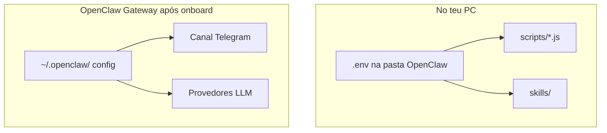

# Onde colocar cada chave (Telegram, Google, ChatGPT, OpenRouter…)

## Resposta curta

| Ficheiro | Caminho | Existe? |
|----------|---------|---------|
| **O teu `.env` (criar tu)** | `G:\Meu Drive\Projetos\OpenClaw\.env` | **Não** — só depois de `copy .env.example .env` |
| **Modelo** | `G:\Meu Drive\Projetos\OpenClaw\.env.example` | Sim — copiar e preencher |

O `.env` **nunca** vai para o GitHub (está no `.gitignore`).

Repositório do projeto: [github.com/Aldebaran-LW/Agente_OpenClaw](https://github.com/Aldebaran-LW/Agente_OpenClaw)

---

## Dois "sítios" no OpenClaw (é normal)



### 1. `.env` no workspace (esta pasta)

Para **scripts** (`macofel-count-pending.js`, `github-repo-status.js`) e skills que leem `process.env`.

Preencher em `.env`:

- `TELEGRAM_BOT_TOKEN` (referência; o bot ativo usa também o onboard)
- `GOOGLE_API_KEY`
- `OPENAI_API_KEY`
- `OPENROUTER_API_KEY`
- `GITHUB_TOKEN`
- credenciais Macofel / MongoDB quando ativares esse cérebro

### 2. Config do Gateway (instalação OpenClaw)

Após `openclaw onboard`, o OpenClaw guarda config em:

- Windows: `%USERPROFILE%\.openclaw\`
- Linux/WSL: `~/.openclaw/`

Aí entram:

- **Telegram** — token do bot, pairing
- **Provedores LLM** — Gemini, OpenAI, OpenRouter (o wizard pede as chaves)

**Dica:** usa os **mesmos valores** do `.env` para não ter duas chaves diferentes.

---

## Mapa chave → uso

| Variável | Para quê |
|----------|----------|
| `TELEGRAM_BOT_TOKEN` | Falar contigo no Telegram |
| `TELEGRAM_ADMIN_CHAT_ID` | Alertas só para ti (opcional) |
| `GOOGLE_API_KEY` | Gemini |
| `OPENAI_API_KEY` | ChatGPT / GPT-4o etc. |
| `OPENROUTER_API_KEY` | Varios modelos numa API — ver [OPENROUTER-MODELOS-FREE.md](./OPENROUTER-MODELOS-FREE.md) |
| `DEEPSEEK_API_KEY` | API direta DeepSeek — ver [DEEPSEEK-API.md](./DEEPSEEK-API.md) |
| `ANTHROPIC_API_KEY` | Claude (opcional) |
| `GITHUB_TOKEN` | Repos Aldebaran-LW |
| `CURSOR_API_KEY` | [Cursor Cloud Agents API](https://cursor.com/docs/cloud-agent/api/endpoints) — `node scripts/cursor-agent.mjs` (EC2) |
| `CURSOR_DEFAULT_REPO` | Alias default ao criar agente (`macofel`, `openclaw`, …) |
| `CURSOR_AGENT_APPROVED` | `1` só na sessão EC2 após `sim` no Telegram — gate de escrita Git |
| `MONGODB_URI` | Agente Macofel (catálogo) |
| `MACOFEL_CATALOG_SECRET` | API sync imagens Macofel |
| `HEARTBEAT_ALERT_COOLDOWN_SEC` | Intervalo mínimo entre alertas (default 3600) |
| `HEARTBEAT_MIN_FREE_RAM_MB` | Alerta se RAM livre abaixo deste valor |
| `OPENCLAW_GATEWAY_PORT` | Porta do gateway (heartbeat HTTP) |
| `TWILIO_ACCOUNT_SID` | Conta Twilio (WhatsApp) |
| `TWILIO_AUTH_TOKEN` | Token Twilio |
| `TWILIO_WHATSAPP_FROM` | Remetente sandbox/produção (`whatsapp:+…`) |
| `TWILIO_WHATSAPP_TO` | Teu número (só lembretes para ti) |
| `SCHEDULED_WHATSAPP_ENABLED` | `1`/`0` — dispatcher no heartbeat (default `1`) |
| `RIMURU_DAILY_TOKEN_BUDGET` | Cota local diária; gate LLM no gateway (default 500000) |
| `RIMURU_GATE_DISABLED` | `1` desactiva bloqueio Rimuru (debug) |
| `HEARTBEAT_TASKS_ENABLED` | `1`/`0` — tarefas autónomas no heartbeat (default `1`) |
| `OPENCLAW_GATEWAY_BASE_URL` | URL produção para health check autónomo |

Ver `docs/HEARTBEAT.md` para o script `scripts/heartbeat.py`.  
Lembretes: `skills/scheduled-whatsapp/SKILL.md`.

---

## Criar o `.env` agora

```powershell
cd "G:\Meu Drive\Projetos\OpenClaw"
copy .env.example .env
notepad .env
```

Guardar e fechar. **Não** fazer commit do `.env`.

---

## Aprovação humana (tua regra)

Mesmo com todas as chaves configuradas:

- Escrita em APIs, deploy, sync de imagens → agente **pede confirmação** no Telegram.
- Configurado em `agents/orchestrator/AGENTS.md` e nas skills de escrita.