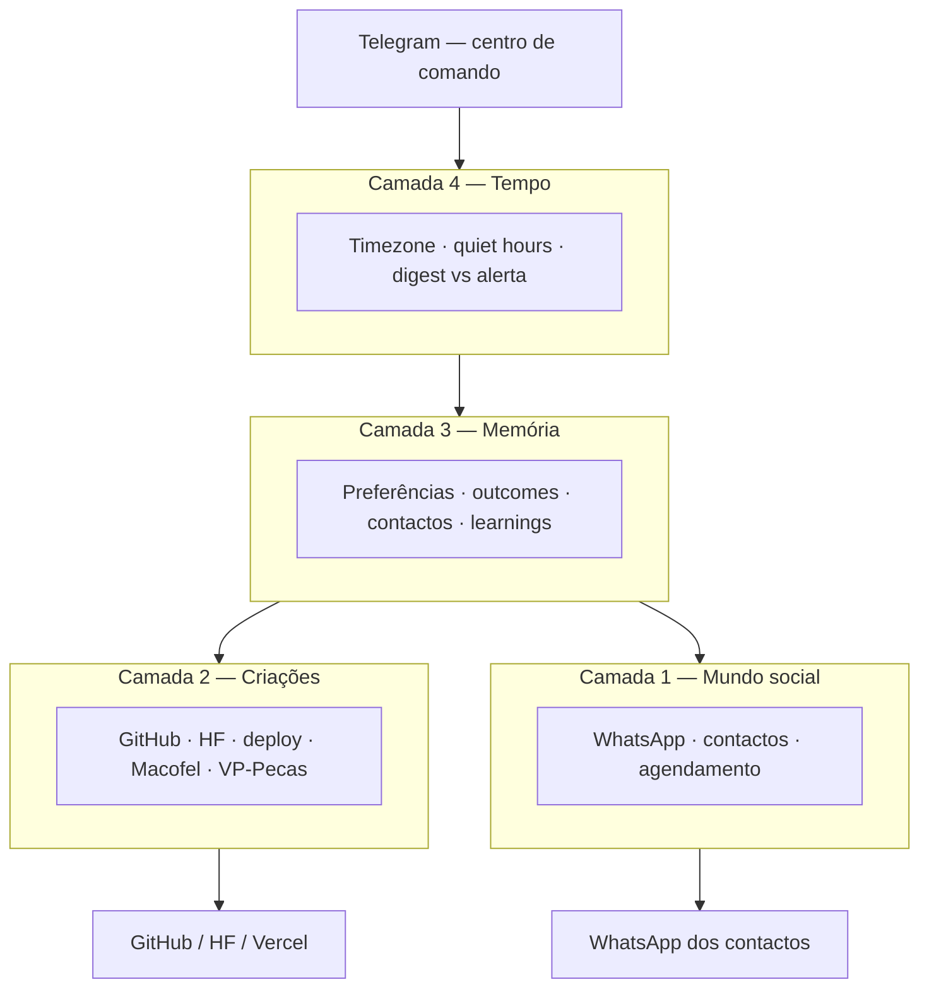
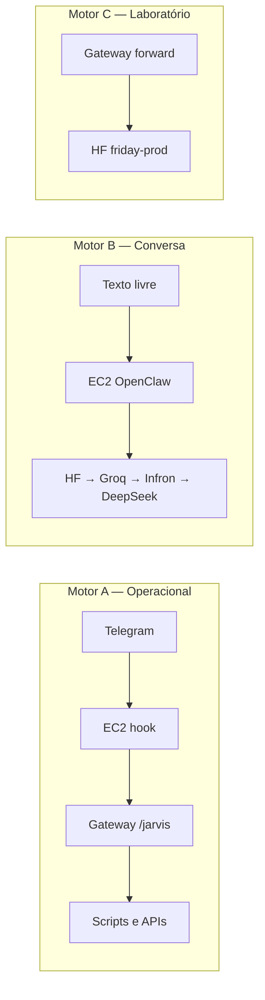
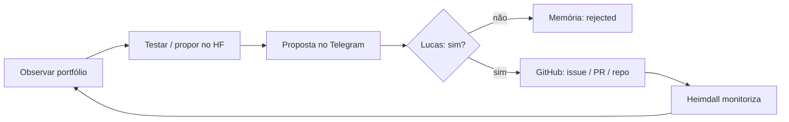

# Visão de produto — F.R.I.D.A.Y. / OpenClaw

**Versão:** 1.0  
**Data:** 2026-06-03  
**Âmbito:** Agente_OpenClaw (Aldebaran-LW) — documento de alinhamento visão ↔ código  
**Relacionado:** [ARQUITETURA-AGENTES.md](./ARQUITETURA-AGENTES.md) · [PAPEIS-AWS-VERCEL.md](./PAPEIS-AWS-VERCEL.md) · [AGENDAMENTO-WHATSAPP.md](./AGENDAMENTO-WHATSAPP.md) · [POLITICA-SEGURANCA.md](../POLITICA-SEGURANCA.md)

---

## Manifesto

O F.R.I.D.A.Y. é o meu **alter ego digital**: mora no Telegram como centro de comando, usa o WhatsApp (via Twilio) como braço social quando eu pedir e confirmar, vai guardando preferências e resultados das minhas decisões, e em paralelo **cuida do portfólio** Aldebaran — observa em tempo real, pensa e testa no Hugging Face, propõe manutenções e criações, e só actua no GitHub depois da minha aprovação. A autonomia sobe **por tipo de tarefa** e por **competência demonstrada**, nunca de uma vez nem em violação da política de segurança.

---

## O que é o F.R.I.D.A.Y.

| Não é | É |
|-------|---|
| Chatbot com 14 personagens no Telegram | **Um sistema** com uma voz (Jarvis) e papéis especializados |
| Assistente de GitHub | **CEO de IA do portfólio** + agente pessoal |
| LLM que responde tudo | **Três motores:** operação sem LLM, conversa com LLM na EC2, laboratório/inovação no HF |
| Autonomia total desde o dia 1 | **Curador proativo** que aprende o que aceito e o que rejeito |

**Interface principal:** Telegram (Lucas ↔ Jarvis).  
**Actuador social:** WhatsApp Business via **Twilio** (oficial, estável).  
**Cofre de secrets e APIs rápidas:** Gateway Vercel.  
**Runtime conversa e cron:** AWS EC2 (OpenClaw).  
**Laboratório:** HF Space `friday-prod` (testes, propostas, inovação).

Regra de arquitectura (não negociável): **Telegram fala com a EC2; a EC2 chama o gateway.** O bot token do Telegram não vive na Vercel.

---

## Arquitectura de intimidade (4 camadas)

Do mais “próximo de ti” ao mais “externo”:

| Camada | Pergunta que responde | Estado actual (v1.0) | Direcção |
|--------|----------------------|----------------------|----------|
| **1 — Mundo social** | Para quem e quando falo no WhatsApp? | Lembretes só para `TWILIO_WHATSAPP_TO` (admin) | Contactos + `to` por job + confirmação |
| **2 — Criações** | Como estão os projetos? | Gateway: Macofel, GitHub, deploy, office | HF propõe → `sim` → GitHub executa |
| **3 — Memória** | O que o Lucas aceita/rejeita? | Hub Supabase + dataset HF (parcial) | JSON preferências + outcomes + perfil |
| **4 — Tempo** | Quando incomodar? | Heartbeat + fila agendada | Quiet hours + alertas P0 em tempo real |

**Telegram** não é só feedback: é **UI única** para modo pessoal (notificações, lembretes, WhatsApp a contactos) e modo portfólio (status, backlog, aprovações).

---

## Três motores (como o sistema corre hoje)

| Motor | Usa LLM? | Quando |
|-------|----------|--------|
| **A** | Não (por defeito) | Comandos reconhecidos: status, github, agendar whatsapp, etc. |
| **B** | Sim | Frase sem rota operacional (“qual a capital do brasil?”) |
| **C** | Às vezes | Inovação, pesquisa, propostas; pode ser determinístico |

A visão **não elimina** os três motores; organiza **quando** cada um entra e adiciona **proactividade** (jobs + backlog) por cima.

---

## Modos de autonomia

Autonomia é **por categoria de tarefa**, não global. Tudo começa em **Supervisionado**; sobe com histórico de acertos e regras explícitas.

| Modo | Significado | Exemplo |
|------|-------------|---------|
| **Supervisionado** | Sugere; só executa após `sim` / 👍 explícito | “Enviar para João amanhã 19h? [Sim/Não/Editar]” |
| **Regras** | Executa se condições pré-definidas | “Lembrete para **mim** < R$0,01 e dentro do horário → envia; senão pergunta” |
| **Confiança total** | Executa e avisa depois | “Relatório semanal enviado às quartas” (só após meses de acerto) |

**Excepção:** alertas **informativos** P0 (site down, quota LLM esgotada) → notificar em **tempo real** sem pedir aprovação (não são actos no mundo).

**Competência** (eixo técnico): a acção correu? alinhou com o pedido? respeitou `POLITICA-SEGURANCA.md`?  
Só sobe de modo quando os três estiverem estáveis para aquela categoria.

Categorias exemplo: `whatsapp_terceiros`, `whatsapp_para_mim`, `github_issue`, `github_pr`, `deploy_prod`, `sugestao_mercado`, `nova_criacao`.

---

## Pipeline de criação (HF → Aprovação → GitHub)

**Nunca** GitHub de escrita antes da aprovação. **Sempre** testar/pensar no HF (ou scripts) primeiro.

| Fase | Onde | O que produz |
|------|------|----------------|
| Observação | Gateway + cron + Rimuru | Snapshots, alertas tempo real |
| Síntese / teste | HF Space, scripts inovação | Brief, rascunho, cenários (sem tocar prod) |
| Proposta | Jarvis → Telegram | Uma mensagem: o quê, risco, esforço |
| Execução | GitHub (após `sim`) | Issue, PR, scaffold de repo |
| Pós | Ícaro (validação) + Heimdall | Regressão, deploy, issues |

**Prioridade de implementação:** agente pessoal (WhatsApp contactos) e alertas claros **antes** de automatizar GitHub.

---

## WhatsApp: do lembrete pessoal ao contato social

### Estado actual (código v1.0)

| Peça | Implementado |
|------|----------------|
| Twilio REST | `scripts/lib/scheduled-whatsapp-core.mjs` |
| Fila | `data/scheduled-whatsapp.json` |
| Dispatch | `heartbeat.py` → `scheduled-whatsapp-dispatch.mjs` |
| Telegram → Jarvis → `sim` | Skill `schedule-whatsapp`, botões |
| Destino | **Apenas** `TWILIO_WHATSAPP_TO` (lembrete para o admin) |

Documentação: [AGENDAMENTO-WHATSAPP.md](./AGENDAMENTO-WHATSAPP.md), [TELEGRAM-WHATSAPP-FLOW.md](./TELEGRAM-WHATSAPP-FLOW.md).

### Visão

| Capacidade | Gate |
|------------|------|
| Agendar mensagem para **contacto** nomeado | Supervisionado (`sim`) |
| Respeitar janela horária / quiet hours | Regras + pergunta se excepção |
| Sandbox: contactos com `join` Twilio | Fase piloto |
| Produção: templates Meta aprovados | Após validar sandbox |
| Feedback 👍/👎 após envio | Alimenta memória |

**Provedor:** Twilio (oficial). **Não** Baileys (instável, fora da política do projeto).

**Worker:** EC2 + heartbeat (sem BullMQ no MVP). Fila JSON é suficiente.

### Sandbox → Produção

1. **Sandbox:** tu + 2–3 números com `join` no número Twilio.  
2. **Produção:** WABA, número próprio, templates HX (`TWILIO_WHATSAPP_USE_TEMPLATE`).

---

## Memória e aprendizado

### O que significa “conhecer o Lucas”

| Nível | Conteúdo | Fase |
|-------|---------|------|
| **Estático** | Timezone, quiet hours, contactos, tom, regras “nunca X” | 1 |
| **Dinâmico** | Tipos de sugestão aceites/rejeitados; ignorar 7d = baixa prioridade | 2 |
| **Profundo** | Inferir intenções, humor, relações | 3+ (cuidado) |

### Onde persiste

| Armazém | Uso |
|---------|-----|
| `data/user-preferences.json` | Preferências locais (MVP) |
| `data/whatsapp-contacts.json` | Rubrica de contactos (MVP) |
| Supabase Hub | `workflow_runs`, `agent_learnings`, aprovações |
| HF `openclaw-backup` | Corpus, episódios, inovação |

**Aprendizado v1:** não é fine-tune contínuo; é **perfil + outcomes + regras** consultados antes de cada digest ou envio.

### Feedback

- **Explícito:** `sim` / `não` / 👍 / 👎 / `nunca mais X`  
- **Implícito:** sem resposta em 7 dias → `ignored` (desce prioridade, não banir para sempre)

---

## Jarvis: dois modos, uma voz

| Modo | Funções |
|------|---------|
| **Pessoal** | Notificações tempo real; agendar WhatsApp (eu ou contactos); lembretes; preferências; conversa quando quiser |
| **Portfólio** | Status Macofel/GitHub/deploy; backlog de propostas; aprovar HF→GitHub; Rimuru (quotas); Heimdall (office) |

**Papéis dos “cérebros”** (Sophia, Yato, Gideon, Heimdall, …) são **funções do pipeline**, não interlocutores separados no Telegram. Jarvis consolida; agentes **não se chamam** entre si.

---

## O que NÃO é (expectativas)

- **Não** substitui o Agente de Catálogo Python na Render (Macofel).  
- **Não** faz pagamentos, checkout ou PIX — nunca, mesmo com `sim`.  
- **Não** envia PII do Lucas a terceiros não autorizados.  
- **Não** envia WhatsApp a contactos **sem** pedido e confirmação (até promoção de autonomia).  
- **Não** é 14 bots ou 14 conversas paralelas.  
- **Não** “evolui arquitetura sozinho” (criar agentes, mudar repos) no horizonte v1.  
- **Não** coloca webhook do Telegram na Vercel (quebra modelo EC2 → gateway).

---

## Métricas de sucesso

Medir se a visão está a progredir (não só “bot responde”):

| Métrica | Alvo inicial | Como medir |
|---------|--------------|------------|
| **Confiabilidade WhatsApp** | ≥95% envios agendados entregues | Log Twilio + confirmação no Telegram |
| **Tempo de alerta P0** | < 5 min desde falha deploy até Telegram | Heartbeat + timestamp |
| **Taxa de aceitação de sugestões** | Baseline; subir com memória | `agent_learnings` / outcomes |
| **Ruído** | < 2 mensagens proativas/dia fora de digest | Contagem Telegram |
| **Pipeline HF→GitHub** | 100% escritas GitHub com `sim` registado | Hub `approval_requests` |
| **Quota LLM** | Zero dias “chat morto” por 402 sem fallback | `rimuru-token-monitor` |

**Métrica norte (piloto):** uma só para as primeiras 8 semanas — sugerir: **“envios WhatsApp a contactos confirmados entregues na hora”** ou **“issues GitHub >30d reduzidas no repo piloto”** (escolher uma).

---

## Ordem de implementação (bússola para código)

| # | Entrega | Prioridade |
|---|---------|------------|
| 1 | Este documento (`VISAO-PRODUTO.md`) | 🔴 ✅ |
| 2 | WhatsApp: contactos + `to` dinâmico (extensão do core) | 🔴 ✅ v1 |
| 3 | Preferências + quiet hours | 🟡 ✅ v1 |
| 4 | Pipeline propostas HF (esqueleto) → GitHub simulado | 🟡 ✅ v1 · [PIPELINE-PROPOSTAS.md](./PIPELINE-PROPOSTAS.md) |
| 5 | Comandos `/quotas` e `/office` (separar Rimuru vs Heimdall) | 🟢 ✅ v1 |
| 6 | Workflow exemplo multiagente (previsão vendas) | 🟢 ✅ v1 |

Antes de cada PR ou feature: **“Isto serve à visão? Qual camada? Qual modo de autonomia?”**

---

## Decisões fechadas na discussão (2026-06)

| Tema | Decisão |
|------|---------|
| WhatsApp | Twilio; sandbox primeiro; sem Baileys |
| Autonomia inicial | Supervisionado; alertas P0 só informam |
| Aprendizado | Comandos explícitos + 👍/👎 + ignorar 7d |
| GitHub escrita | Só após aprovação; HF antes |
| Worker agendamento | EC2 + heartbeat (fila JSON) |
| Telegram | Centro de comando; não mover para Vercel |
| `/status` BotFather | Mantém `status macofel`; quotas → `/quotas` ou `rimuru status` |

---

## Changelog

| Versão | Data | Notas |
|--------|------|-------|
| 1.0 | 2026-06-03 | Primeira versão — alinhamento visão alter ego + portfólio |
| 1.1 | 2026-06-03 | Comandos 2–6: WhatsApp contactos, preferências, propostas, /quotas, /office, workflow vendas |
