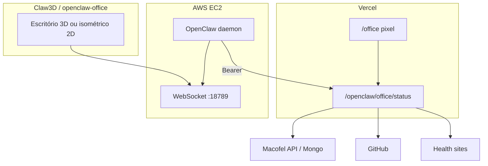

# Visualização de agentes — Claw3D, Office e Pixel

Três camadas complementares para ver o OpenClaw sem depender só do Telegram ou do terminal.

**Dashboards da comunidade** (Star Office UI, AgentMonitor, tenacitOS, etc.): **[DASHBOARDS-VISUAIS.md](./DASHBOARDS-VISUAIS.md)** — tabela completa, `set_state.py`, install na EC2.

**Digital Forge (F.R.I.D.A.Y.)** — Quartel General 3D cobalto/branco: **[DIGITAL-FORGE-FRIDAY.md](./DIGITAL-FORGE-FRIDAY.md)** — `/forge` + WebSocket `:8787`.

| Etapa | O quê | Onde corre | Ligação |
|-------|--------|------------|---------|
| **1** | Gateway + rotas de status | Vercel (`gateway/`) | REST + Bearer |
| **2** | Painel pixel-art | Vercel `/office` | `GET /openclaw/office/status` |
| **3** | Claw3D / openclaw-office | PC browser → EC2 | WebSocket OpenClaw `:18789` |

Telegram **nunca** fala com estes painéis. Fluxo de produção: **Telegram → AWS → Gateway → APIs**.

---

## Arquitetura



---

## Etapa 1 — Gateway (já no repo)

Rotas usadas pelo painel e pelos scripts:

| Rota | Auth | Uso visual |
|------|------|------------|
| `GET /api/health` | Público | Gateway vivo |
| `GET /openclaw/office/status` | Bearer | Snapshot dos 4 cérebros |
| `GET /openclaw/macofel/status` | Bearer | Macofel |
| `GET /openclaw/github/status` | Bearer | Ops |
| `GET /openclaw/deploy/health` | Bearer | VP-Pecas + sites |

Deploy: [GATEWAY-VERCEL.md](./GATEWAY-VERCEL.md).

Teste local após deploy:

```bash
cd scripts && node check-basico.js
node scripts/office-status.js
```

---

## Etapa 2 — Painel pixel-art (Vercel)

URL: `https://<teu-gateway>/office`

1. Abre `/office` no browser.
2. Cola o **mesmo** `OPENCLAW_AUTOMATION_TOKEN` da Vercel (guardado só em `sessionStorage` do browser).
3. Clica **Guardar sessão** — polling a cada 30 s.

### Estados dos avatares

| Estado | Label | Quando |
|--------|-------|--------|
| `idle` | ocioso | Sem trabalho pendente |
| `thinking` | pensando | Lentidão ou config em falta |
| `working` | trabalhando | Catálogo, issues ou deploys a tratar |
| `error` | erro | API/repo/site em falha |

### Mapeamento cérebro → mesa

| ID | Nome | Mesa no painel | Fonte de dados |
|----|------|----------------|----------------|
| `orchestrator` | Jarvis | Centro | Agregado dos outros |
| `macofel` | Macofel | Esquerda | `macofel/status` |
| `vp-pecas` | VP-Pecas | Direita | `deploy/health` (site vp-pecas) |
| `ops` | Ops | Fundo | GitHub + deploys |

**Limitação:** não é tempo real ao nível de tool-calls/chat — é snapshot REST. Para isso, usa Claw3D (etapa 3).

---

## Etapa 3 — Claw3D / openclaw-office (EC2)

O OpenClaw **completo** na EC2 expõe WebSocket (porta típica **18789**). Claw3D e [openclaw-office](https://github.com/WW-AI-Lab/openclaw-office) consomem eventos `agent`, `presence`, `health`, `heartbeat`.

### Pré-requisitos na EC2

- OpenClaw a correr (`openclaw doctor` OK).
- Porta `18789` **não** exposta à internet sem túnel/auth.
- Mesmo `OPENCLAW_AUTOMATION_TOKEN` entre Vercel e EC2 (para REST); WS usa URL/token do gateway OpenClaw local.

### Script automático (EC2, Linux)

No servidor, a partir do clone do repo:

```bash
chmod +x scripts/setup-claw3d-ec2.sh
./scripts/setup-claw3d-ec2.sh
```

O script verifica o daemon, imprime URL WebSocket local e instruções para Claw3D Studio.

### Túnel a partir do Windows (dev)

```powershell
.\scripts\claw3d-tunnel.ps1
```

Variáveis opcionais no `.env` ou ambiente:

| Variável | Exemplo | Uso |
|----------|---------|-----|
| `OPENCLAW_EC2_HOST` | `ec2-user@18.x.x.x` | SSH |
| `OPENCLAW_WS_LOCAL_PORT` | `18789` | Porta local do túnel |
| `OPENCLAW_GATEWAY_WS_URL` | `ws://127.0.0.1:18789` | Claw3D / Office |

Depois do túnel:

1. [Claw3D](https://www.claw3d.ai/) ou clone [symbiosissolutions/Claw3D](https://github.com/symbiosissolutions/Claw3D).
2. Liga **Gateway URL** = `ws://127.0.0.1:18789` (ou token que o teu OpenClaw pedir).
3. Vês avatares 3D, mesas, standups, etc.

Alternativa 2D isométrica (menos GPU):

```bash
git clone https://github.com/WW-AI-Lab/openclaw-office.git
cd openclaw-office && npm install && npm run dev
```

### Segurança

- Não commits URL/token WS no Git.
- Não abras `18789` no Security Group para `0.0.0.0/0`.
- Preferir SSH tunnel ou VPN.
- Painel `/office` usa Bearer — não partilhes o token em issues públicas.

---

## Comparação rápida

| | Pixel `/office` | AgentMonitor | Star Office | openclaw-office | Claw3D |
|--|-----------------|--------------|-------------|-----------------|--------|
| Deploy | Vercel | EC2/local | EC2/local | EC2/local | EC2/local |
| Tempo real | ~30 s polling | WS ~5 s | `set_state` / API | WebSocket | WebSocket |
| GPU | Não | Baixa | Baixa | Baixa (SVG) | 3D |
| Chat / tools | Não | Sim | Via OpenClaw | Sim | Sim |
| Só REST Vercel | **Sim** | Não | Parcial | Não | Não |

Instalar AgentMonitor ou Star Office: `./scripts/install-visual-dashboard.sh`

---

## Ficheiros no repo

| Ficheiro | Função |
|----------|--------|
| `gateway/lib/office.mjs` | Agrega estados dos agentes |
| `gateway/api/openclaw/office/status.mjs` | API snapshot |
| `gateway/public/office/*` | UI pixel-art |
| `scripts/setup-claw3d-ec2.sh` | Setup EC2 |
| `scripts/claw3d-tunnel.ps1` | Túnel SSH Windows |
| `scripts/office-status.js` | Teste CLI do snapshot |
| `scripts/set_state.py` | Estado para Star Office / JSON local |
| `scripts/install-visual-dashboard.sh` | Clone AgentMonitor, Star Office, etc. |
| `scripts/dashboard-tunnel.ps1` | Túnel HTTP :3000 / :19000 |
| `agents/_shared/DASHBOARD-SYNC.md` | Regras para SOUL.md na EC2 |

---

## Próximos passos opcionais

- Dominio `/office` com Vercel Authentication OFF (só o token protege dados).
- WebSocket proxy na Vercel (avançado; custo/latência) — hoje não implementado.
- Sprites PNG custom por agente em `gateway/public/office/sprites/`.

Ver também: [PAPEIS-AWS-VERCEL.md](./PAPEIS-AWS-VERCEL.md), [BASICO-OPENCLAW.md](./BASICO-OPENCLAW.md).
